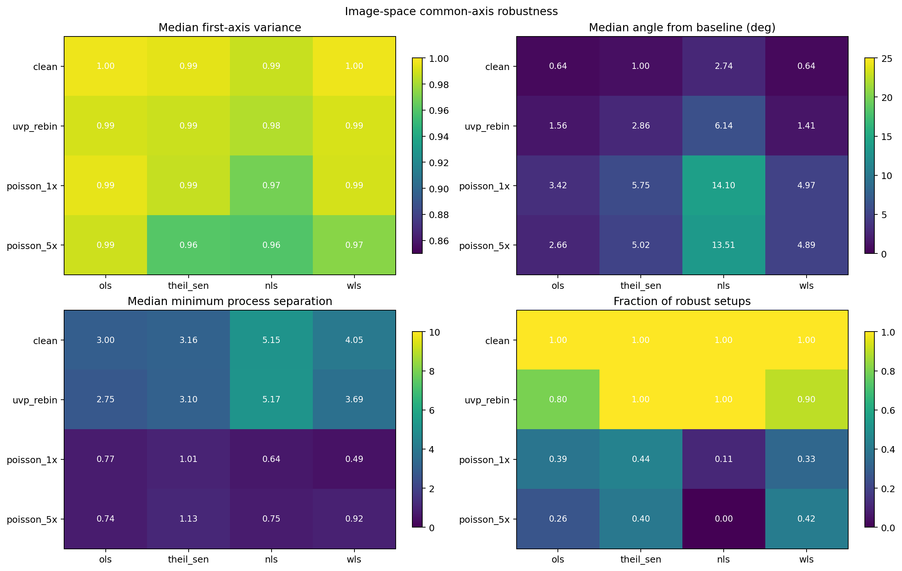
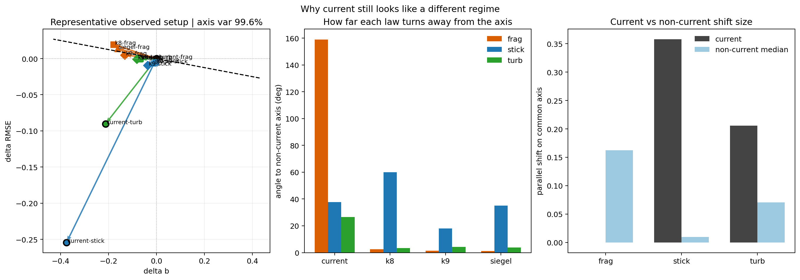
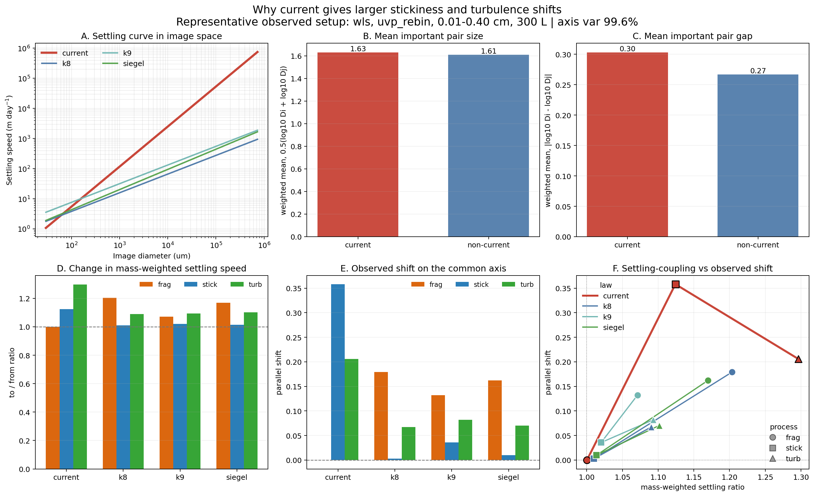

# Report - Apr 01, 2026

This report is a follow-up to the Mar 30 report. There, one pattern looked important. In image space, the three sinking laws often moved on one main `delta b`-`delta RMSE` line, while `current` did not follow them as well.

Here current-just means the present/default sinking law i have been using in the model. The other three laws are `kriest_8`, `kriest_9`, and `siegel_2025`. So when i say non-`current`, i mean those three other laws together.

After that result, i was thinking about-  is that common line still there if i change the analysis choices? Second, if `current` really stays different, why does that happen?

So in this step i only did three things. I checked how stable the common axis is. Then i checked whether `current` still stays separate in one good observed setup. Then i made one mechanism figure to see why `current` gives larger stickiness and turbulence shifts there.

## what the setup names mean here

Before the figures, here i want to add soeething

- `ols`: the simple straight-line fit in log-log space
- `theil_sen`: a more robust line fit, so a few odd points matter less
- `nls`: nonlinear least squares
- `wls`: weighted least squares, so the sparse noisy tail does not pull the fit too much

- `clean`: the model PSD before the UVP-like observation step
- `uvp_rebin`: the PSD is moved onto UVP size bins, but i do not yet add the full random counting noise
- `poisson_1x`: one noisy sampled realization after the observation step
- `poisson_5x`: average of five noisy sampled realizations

## what i planned here

The plan was simple:

1. check whether the image-space common axis stays there when i change the analysis setup  
2. compare `current` with the other three laws in one safer observed setup  
3. make one direct mechanism figure for why `current` gives large stickiness and turbulence shifts  

 scripts i used:

- `run_image_space_common_axis_robustness.py`
- `run_current_regime_compare.py`
- `run_current_direct_mechanism_test.py`
it  is just the next planned step after the Mar 30 report.

## first, i checked whether the common axis survives reasonable analysis changes

In the last report, the common-axis result looked good, but i still needed to check whether it stayed there after changing the setup. I used `run_image_space_common_axis_robustness.py` for this.

I changed four things:

- fit window
- sample volume
- observation stage
- fit method

Then for each setup, i checked three simple things:

- does most of the non-`current` spread still stay on one axis?
- does that axis still point in almost the same direction?
- do fragmentation, stickiness, and turbulence still keep some separation on that axis?

In all four panels, the x-axis is the fit method and the y-axis is the observation stage.

top-left : does one axis still explain most of the spread?  
top-right : did the axis direction rotate a lot?  
bottom-left : do the processes still stay separated enough?  
bottom-right : across many tested windows and volumes, how often did that method-stage family stay strong?

The common axis still shows up after this wider check. So it does not look like only one lucky setup. `clean` and `uvp_rebin` stayed strong most of the time. The noisier sampled stages were weaker, but the axis was often still there. Across the non-clean setups, about `0.79` of the cases still looked strong.

So i think this axis is good to keep, especially in safer image-space settings like `uvp_rebin`. I would just stay more careful in the fully noisy sampled stages.

## then, i checked whether `current` still looks separate in a representative observed setup

Once the common axis looked stable enough, the next question became smaller and clearer. If the non-`current` laws stay near one shared axis, does `current` still stay separate in a setup that is both observed-style and fairly stable? I used `run_current_regime_compare.py` for this.

From the  sweep, i chose one representative observed setup:

- `wls`
- `uvp_rebin`
- `0.01-0.40 cm`
- `300 L`

I picked this setup because it was one of the cleaner observed families. The non-`current` axis variance there was `0.996`, so the shared axis was still very strong.

In the left panel, the x-axis is `delta b` and the y-axis is `delta RMSE`. The dashed line is the shared non-`current` axis. Points near that line behave more like the non-`current` family. Points that turn away look more different.

In the middle panel, the x-axis is the sinking law and the y-axis is the angle away from that axis. In the right panel, the x-axis is the process type and the y-axis is the shift size along the axis.

The short result is this: `current` still does not behave like the other three laws in this setup. But it is not bigger in every case. For fragmentation, `current` stays close to zero. For stickiness and turbulence, it shifts much more and turns away more strongly.

So the `current` split still looks real here. That is why i next checked the mechanism more directly.

## then, i built one direct mechanism test for why `current` gives larger stickiness and turbulence shifts

For this last step, i wanted one figure that linked the settling law to the observed image-space shift more directly. I used `run_current_direct_mechanism_test.py`.

The idea was simple. If `current` gives larger stickiness and turbulence shifts, maybe the aggregation change is feeding more strongly into settling itself. So i compared:

- the settling-speed curve in image space
- the typical size of the important particle pairs
- the typical size gap of those pairs
- the change in mass-weighted settling speed
- the observed parallel shift on the shared axis

The main theme of this figure is simple: when the settling response gets larger, the observed shift also gets larger, and `current` is the clearest case.

Panel A shows that `current` rises much faster with size than the other laws. Panels B and C show that the important pair activity in `current` sits at a slightly larger size and a slightly larger size gap. Panel D shows the change in mass-weighted settling speed. Panel E shows the observed shift on the common axis. Panel F puts the last two together.

The short result is yes, especially for `current`. For stickiness and turbulence, `current` gives both a larger settling response and a larger observed shift. The other laws stay lower and closer together.

Fragmentation is different. There, `current` stays near `1` in settling ratio and near zero in common-axis shift. So `current` is not just bigger for everything.

So my reading here is simple. `current` seems to have stronger aggregation-to-settling coupling. Its settling curve is steeper, so a small upward move in the important interacting pairs gives a bigger settling response, and that lines up with the bigger observed image-space shift.

## what i think now

The common axis stayed there after the wider test. The `current` split also stayed there in a representative observed setup. And the mechanism figure gives one simple reason for that split: `current` seems to turn aggregation-driven changes into a bigger settling response.

- The three other laws still share one strong image-space response axis in `delta b` and `delta RMSE`. But `current` behaves more like a different regime because its steeper settling law makes stickiness and turbulence feed more strongly into settling loss and then into the observed PSD shift.

## next step

At this point, i am thinking that am i in a right direction?

One possible next step could be add zooplankton fragmentation or a pellet-like source? That may help check whether one missing biological process can make a PSD shift larger than the present turbulence-fragmentation model or different something?

