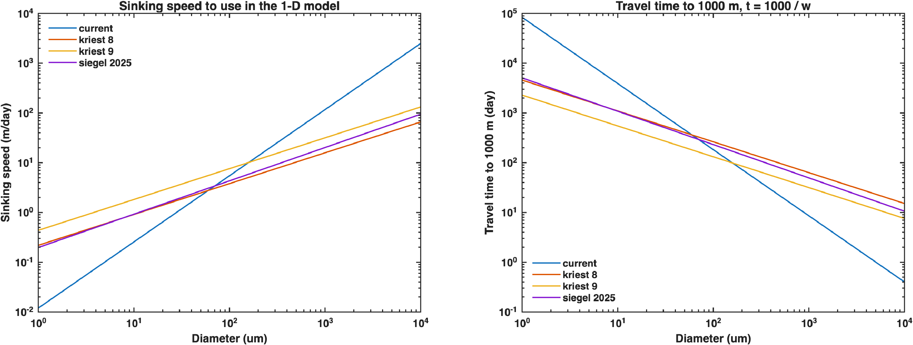
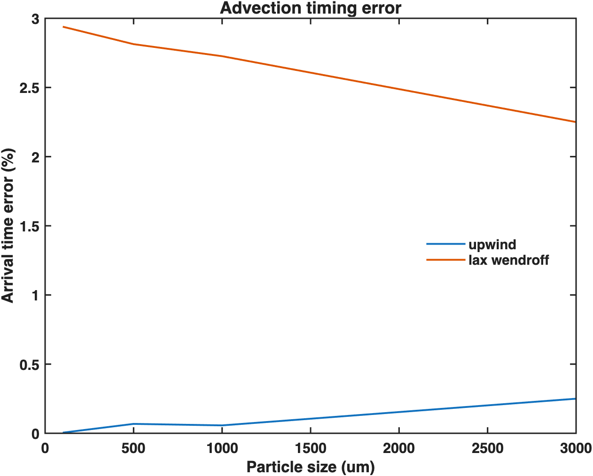
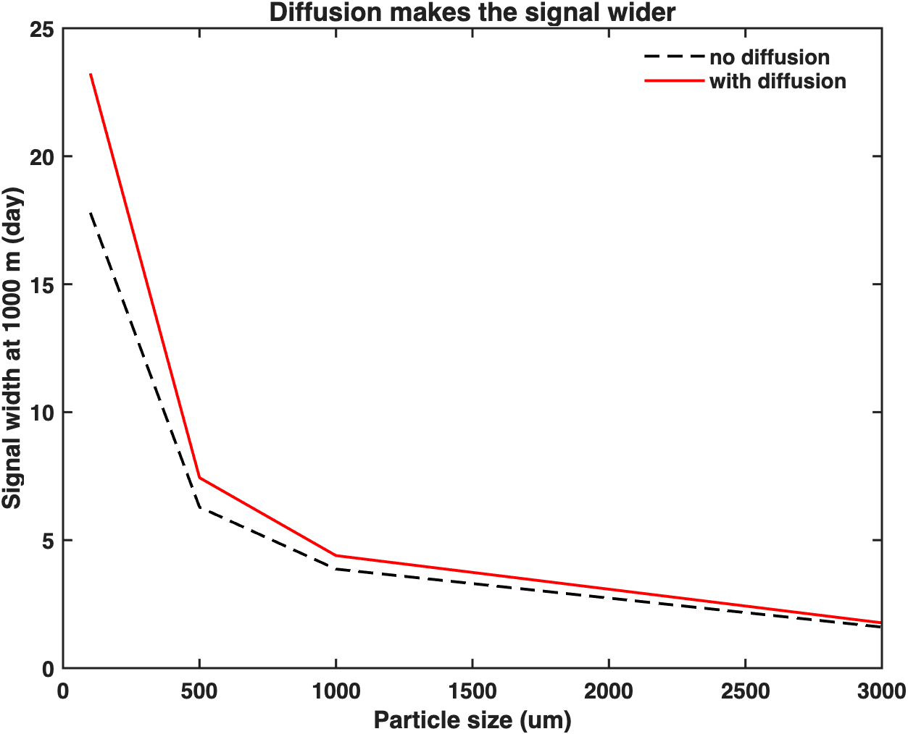
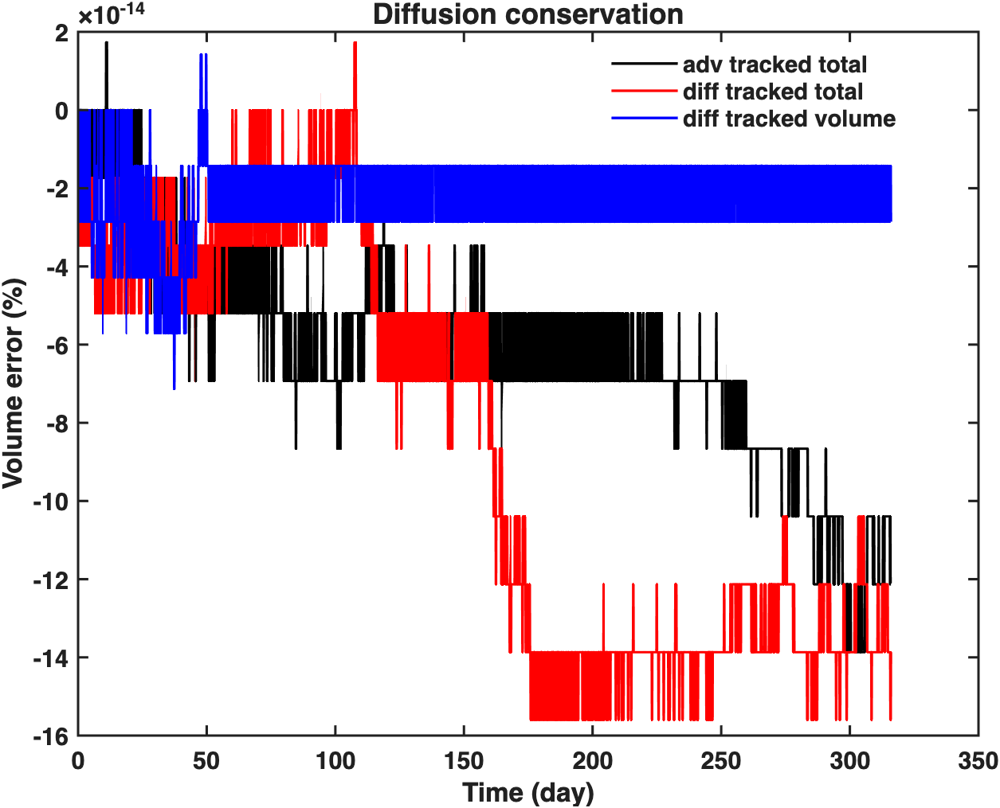
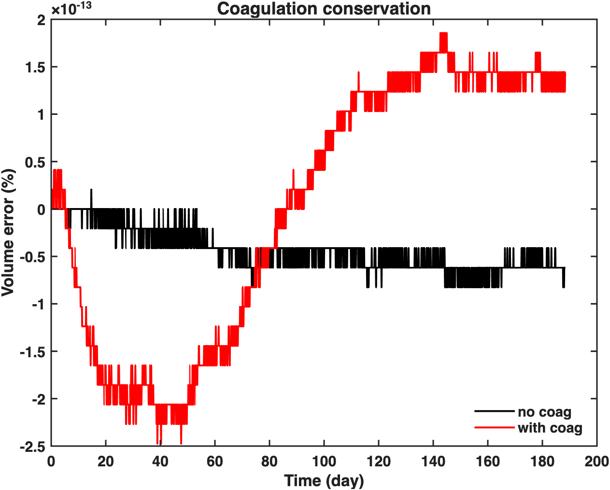
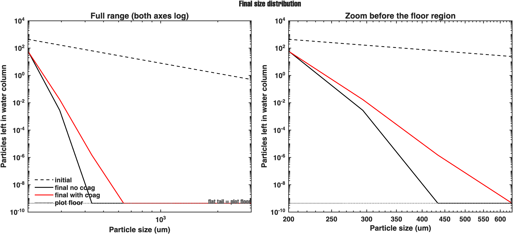
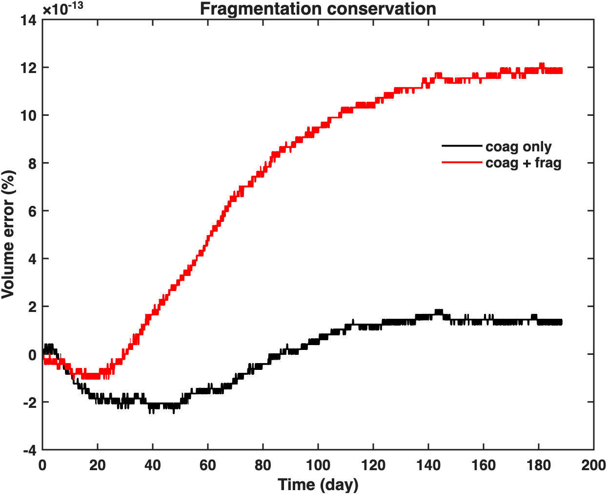
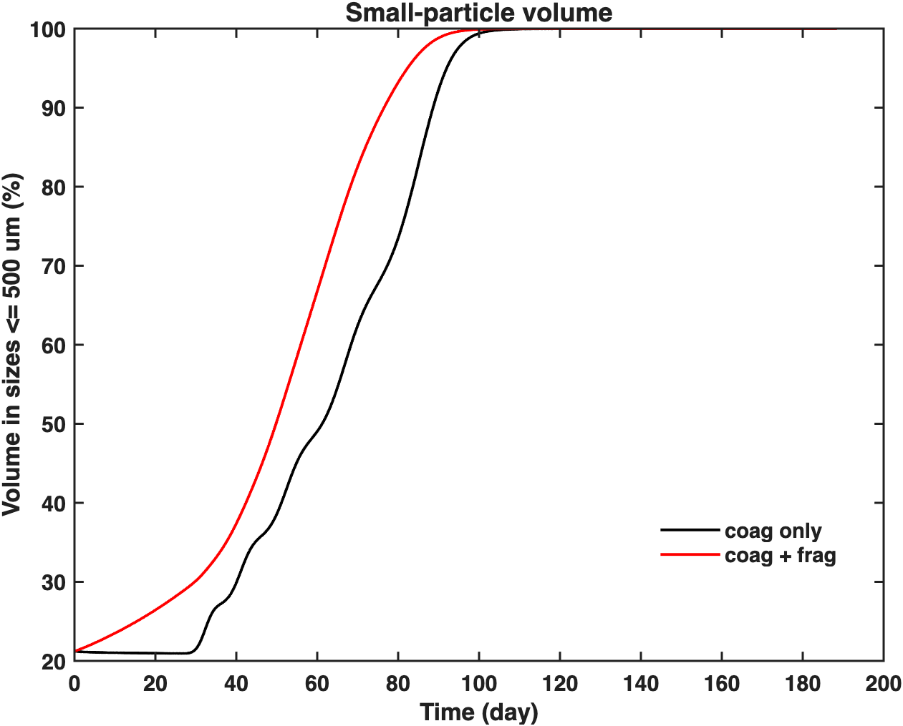
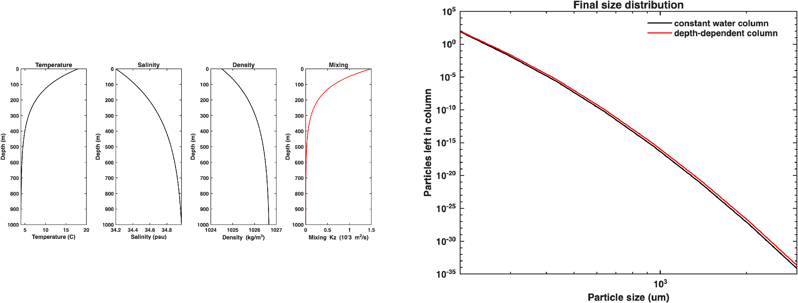
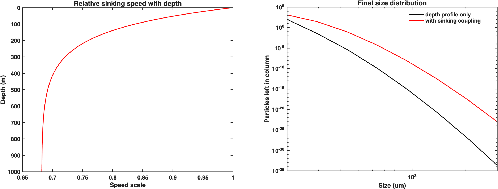

# Report - Apr 09, 2026 - 1-D model

- Where are we now, and what is already in the model?
- How much do the different sinking-speed laws matter?
- Can the transport be trusted before more physics is added?
- What changes when diffusion, coagulation, and fragmentation are added one by one?

## steps i followed

1. Add the different sinking-speed laws.
2. Keep the first water column simple: one density, one temperature, one salinity.
3. Test advection only.
4. Add diffusion.
5. Add coagulation.
6. Add fragmentation.
7. Check conservation at each stage (mass, volume and n error)
8. Only after that, move to depth-dependent structure.

## Step 1. Add the sinking-speed laws

Before I tested transport, I first checked the settling laws themselves. At this stage I am not trying to say which law is best. I only want to see how much the sinking timescale changes from one law to another.

The named laws used here are:

- `current`
- `kriest_8`
- `kriest_9`
- `siegel_2025`

For the simpler laws, the code uses forms close to

- `kriest_8: w = 66 d^0.62`, with `d` in `cm`
- `kriest_9: w = 132 d^0.62`, with `d` in `cm`
- `siegel_2025: w = 20.2 D_mm^0.67`, with `D_mm` in `mm`

The `current` law is more complicated in the code because it uses the image-to-volume relation already in the repo. The practical difference is easy to see in the figure: it is slow for very small particles, but it increases much faster as size gets larger.

The left panel is the direct speed view. The x-axis is diameter in `um`, and the y-axis is sinking speed in `m/day`. Both axes are on log scales. A higher curve means faster sinking. At the small-size end, `current` is the slowest of the four. Then it steepens, crosses the other laws, and becomes the fastest at the large-size end.

The right panel is not a new calculation. It is just the inverse view of the left panel, using

`t_1000 = 1000 / w`

where `1000` is depth in `m` and `w` is in `m/day`, so `t_1000` is in `day`. Because of that, any law that is higher on the left panel must be lower on the right panel. The crossing points also stay at the same particle diameter in both panels.

So the main reading is this: `current` starts with the longest travel time for very small particles, but it drops much more steeply and becomes the shortest travel-time curve once the particles are large enough. `kriest_9` is always faster than `kriest_8` because it has the same slope and a larger prefactor. `siegel_2025` stays between the Kriest laws and `current` over much of the range.

For the `1 mm` case, the travel times to `1000 m` are about `8.56 day` for `current`, `63.16 day` for `kriest_8`, `31.58 day` for `kriest_9`, and `49.50 day` for `siegel_2025`.

This matters for the later 1-D runs because the same starting particle field will reach depth on very different timescales depending on which sinking law is used.

## Step 2. Test advection only

The next check removes diffusion, coagulation, and fragmentation and leaves only advection. The question here is simple: do the particles arrive at `1000 m` when they should, and does the scheme stay stable while doing that?

I compared two schemes:

- `upwind`
- `lax_wendroff`

In this figure:

- the x-axis is particle size in `um`
- the y-axis is arrival-time error in `%`
- lower is better

What I found:

- `upwind` stayed non-negative and gave the smaller timing error
- `lax_wendroff` gave many negative values and a larger timing error
- in the current step summary, `upwind` had `neg_count = 0` and mean travel-time error about `0.0949 %`
- `lax_wendroff` had `neg_count = 537690` and mean travel-time error about `2.4621 %`

But you told lax_wendroff should work better!!! Then i tried to add diffusion,  coagulation and fragmentation again and got the same result.

## Step 3. Add diffusion

Once the advection-only case was under better control, I added physical diffusion. Here I wanted to check two things at once: does the bottom signal broaden in the expected way, and does the tracked-volume budget stay clean?

In this figure, the x-axis is particle size in `um`, and the y-axis is the width of the bottom signal at `1000 m`, measured in days. The no-diffusion and diffusion cases are plotted together. The diffusion run gives a broader signal for all four tested sizes, which is what I would expect from adding vertical mixing.

For example, the `100 um` signal width increases from about `17.79` to `23.24 day`, and the `1000 um` width increases from about `3.87` to `4.40 day`.

The conservation figure is the budget check for the same step. The x-axis is time in days, and the y-axis is volume error in percent. The tracked-volume error stays extremely small, on the order of `1e-13 %` to `1e-14 %`.

So the diffusion step is doing what it should in this test: the signal broadens, but the budget does not drift.

## Step 4. Add coagulation

After transport and diffusion were in place, I added coagulation. For this first 1-D check I kept the kernel simple and used `shear_only`.

Within one depth cell, the pair-collision update is based on

`dn = beta(i,j) N_i N_j dt_sub`

That removes particles from bins `i` and `j` and remaps the merged volume into larger bins conservatively.

This first figure is still the budget check. The x-axis is time in days, and the y-axis is tracked-volume error in percent. The no-coagulation and with-coagulation runs both stay very close to zero. In this test the maximum tracked-volume error stays around `1e-13 %`.

This figure is easier to read for the coagulation effect.

- Dashed black: initial size distribution
- Solid black: final state without coagulation
- Red: final state with coagulation
- X-axis: particle size in `um`
- Y-axis: particles left in the water column
- Both axes are log scale

The left panel shows the full range. The right panel shows the part before the curves hit the plot floor.

- The red line is above the black line at larger sizes.
- That means coagulation moves some material into larger size bins.
- The change is there, but it is not very large.
- In this test, sinking and export are still strong, so they are competing with coagulation.

This is not mainly about one peak moving. It is more about the red and black curves separating across the larger-size side.

The flat lower tail should not be over-read.

- I checked the plotting code directly.
- For this log-scale plot, very small values are clipped to a plot floor before drawing.
- So the flat tail is a display effect for the log y-axis.
- It is not a real constant abundance from the model.

## Step 5. Add fragmentation

Once the coagulation step was behaving properly, I added fragmentation. This is still a simple breakup rule, not the final fragmentation model.

The current breakup rate in the code is

`r_k = (c3 c4^k) / 86400`

When a large particle breaks, the resulting smaller fragments are placed into smaller size bins without losing or creating total volume.

Again, the first figure is the budget check. The tracked-volume error stays very small in both the coagulation-only and coagulation-plus-fragmentation runs.

- x-axis is time in days. 
- y-axis is the percentage of particle volume in sizes `<= 500 um`. 
- The fragmentation case reaches that small-size side sooner than the coagulation-only case. In the output summary, the time to reach `80 %` small-size volume changes from about `83.66 day` to about `68.24 day`.

So the fragmentation step is doing what I expected in this first test. It returns volume toward smaller sizes earlier. 

## Step 6. Add depth-dependent structure

I only moved to depth-dependent structure after the simpler constant-column steps were behaving well. That way, if something changed here, it was easier to see where it came from.

In this first depth-profile step, I included four depth fields:

- `Kz(z)`
- `T(z)`
- `S(z)`
- `rho(z)`

Only `Kz(z)` is used directly in the transport in this step. The temperature, salinity, and density profiles are stored and plotted, but they are not yet fully used in the main process terms.

In this figure, the left block shows the depth profiles. The y-axis is depth in `m`. Those panels show how temperature, salinity, density, and mixing change with depth. The right panel compares the final PSD for the constant-column case and the depth-profile case.

For the depth profiles themselves, the output ranges are about:

- `Kz(z)`: `1.36e-6` to `1.50e-3 m^2/s`
- temperature: `4.02` to `18.00 C`
- salinity: `34.20` to `34.97 psu`
- density: `1024.50` to `1026.66 kg/m^3`

The PSD does change when I move from a constant water column to a depth-dependent one, but the change is not large or erratic. The tracked-volume error stays around `1e-12 %`, so this step still looks numerically clean.

At this stage I feel fairly confident about the numerics. The main limit is just that only `Kz(z)` is affecting the transport directly so far.

## Step 7. First depth-dependent sinking-speed coupling

- After building the depth structure in Step 6, the next step was to let that structure affect a real process term.
- Here I used the depth profiles to scale sinking speed with kinematic viscosity.
- In simple form, the code computes:

`nu(z) = mu(T(z)) / rho(z)`

- Then that is used to scale the baseline sinking speed with depth.
- In simple words, the deeper water in this setup is colder and more viscous, so sinking becomes slower with depth.
- The temperature, salinity, density, and mixing profiles are unchanged from Step 6. Here I only show the new sinking-speed coupling result.

Left panel: relative sinking-speed scale with depth
- Y-axis: depth in `m`
- X-axis: factor applied to the baseline sinking speed
- The scale stays near `1.000000` at the top and drops to about `0.682024` near the bottom
Right panel: final PSD after the sinking-speed coupling is added

- Slower deep sinking means more particles stay in the water column
- The final PSD shifts upward relative to the depth-profile-only case
- The budget still looks clean
- In the print summary, the time to reach `80 %` small-size volume changes from about `68.32 day` to about `88.54 day`
- The final total-number change switches sign

## Budget and conservation

After looking at the steps one by one, it is easier to look at the budget across the model runs.

Here I do not only look at the particle volume still inside the water column. I track

- volume in the column
- volume out of the bottom
- tracked total

The tracked total is the sum of the first two. If the model is only moving volume around, then that total should stay flat.

This is useful because each process changes where the volume sits, but it should not create or remove tracked volume by mistake:

- advection moves volume downward and out of the box
- diffusion spreads volume in depth
- coagulation shifts volume toward larger bins
- fragmentation shifts volume back toward smaller bins

Each subpanel has the same three curves. The black line is `volume in column`. The red line is `volume out bottom`. The blue line is `tracked total`. The y-axis is volume as percent of the initial total, and the x-axis is time in days.

The blue curve stays close to `100 %` in all four panels, so the tracked-volume budget stays under control while new processes are added.

The step-7 panel is the easiest one to compare physically. There the black line stays higher for longer and the red line rises more slowly. That means more volume remains in the column and less has left the bottom by the same time. That matches the slower deep sinking in that run.

I have not added a separate degradation term yet, so this report does not include a degradation budget.

## What still needs more checking

These parts still need more work:

- `lax_wendroff` is not yet trusted in the current setup
- the coagulation tests so far use `shear_only`, not the full mixed kernel
- fragmentation is still a simple conservative rule, not a final breakup model

