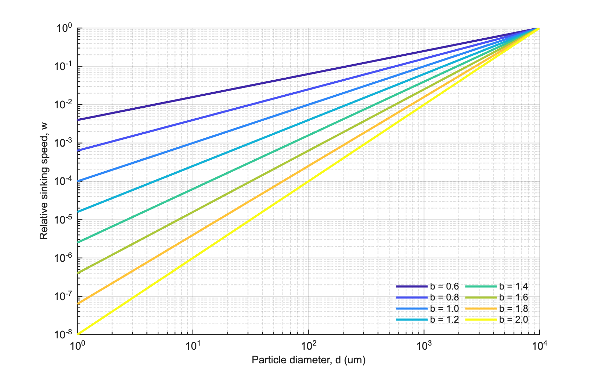
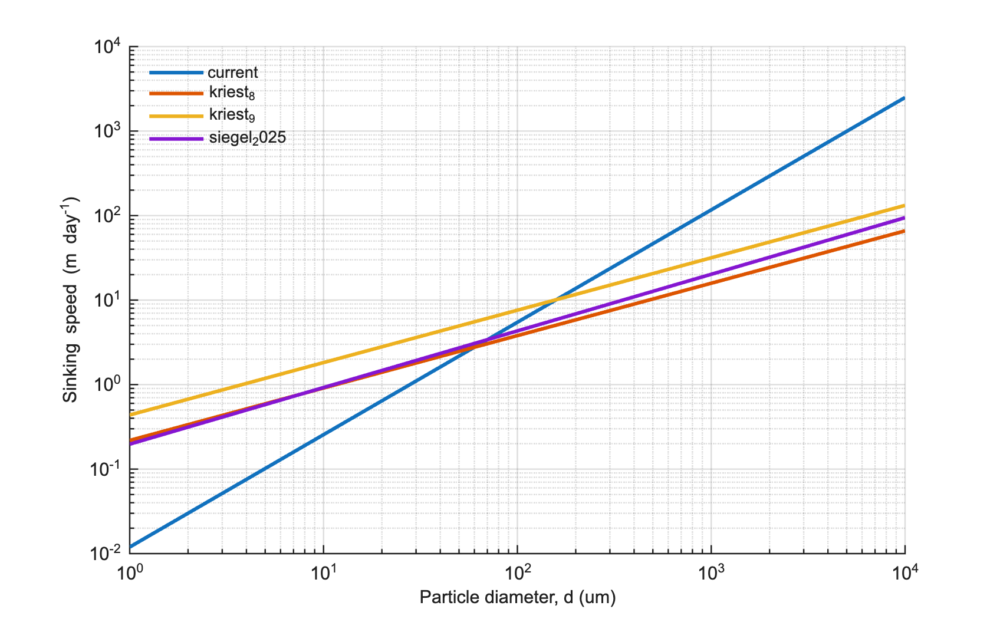
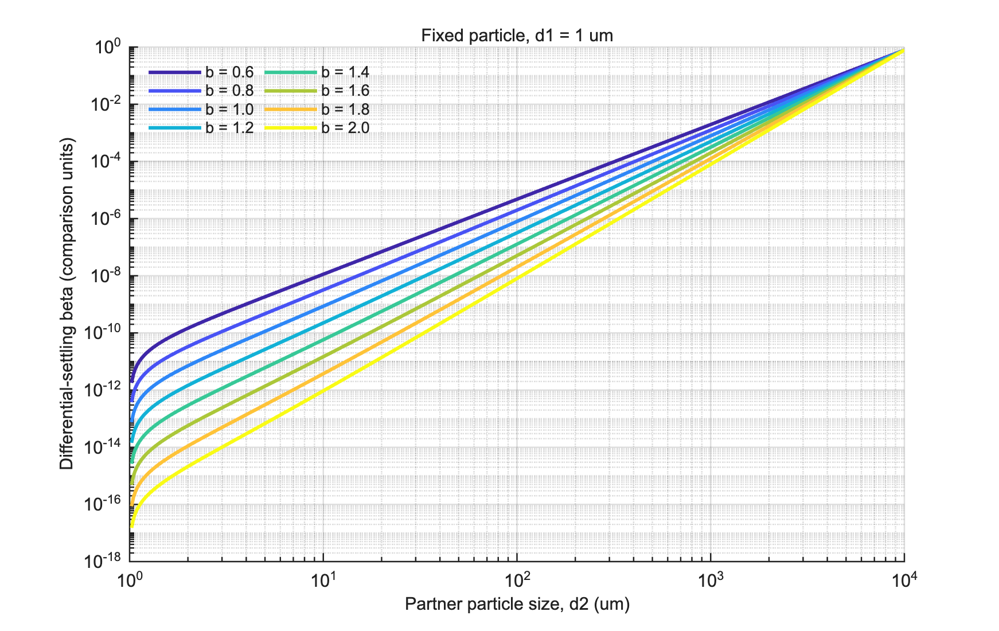
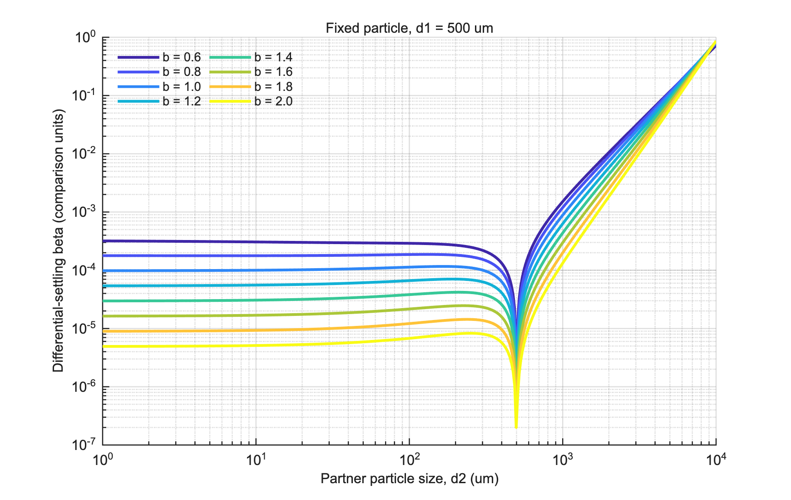
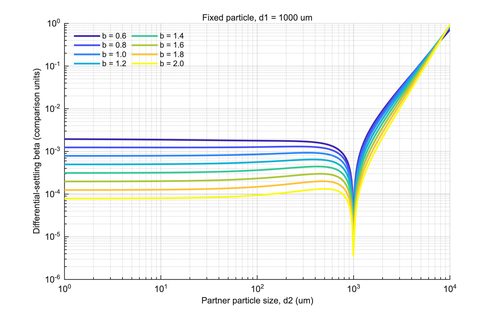
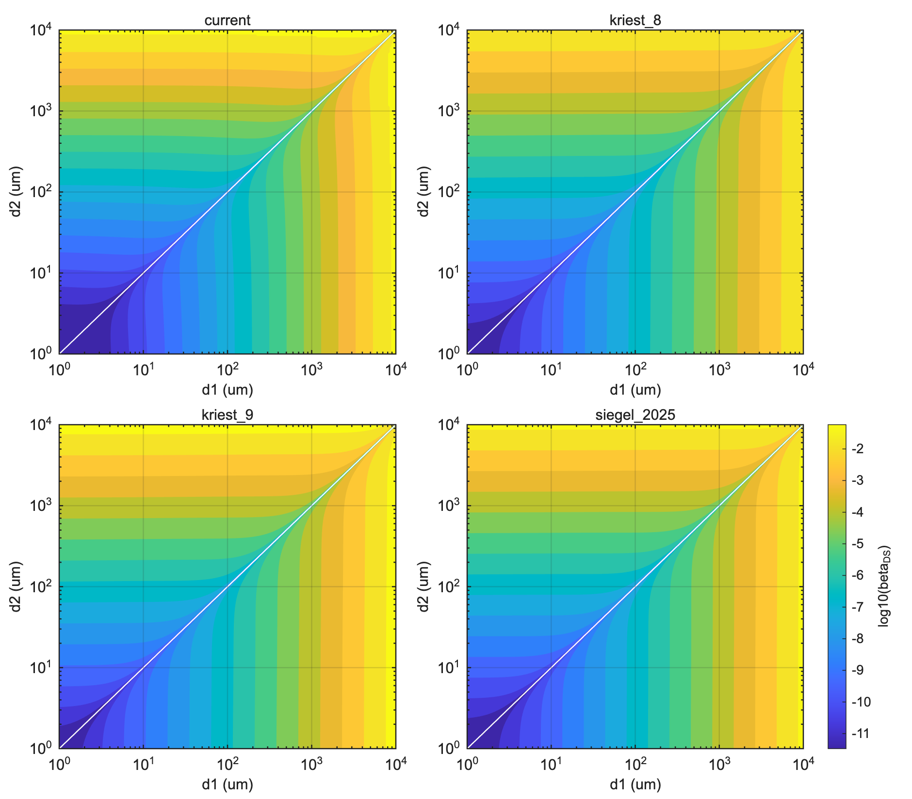
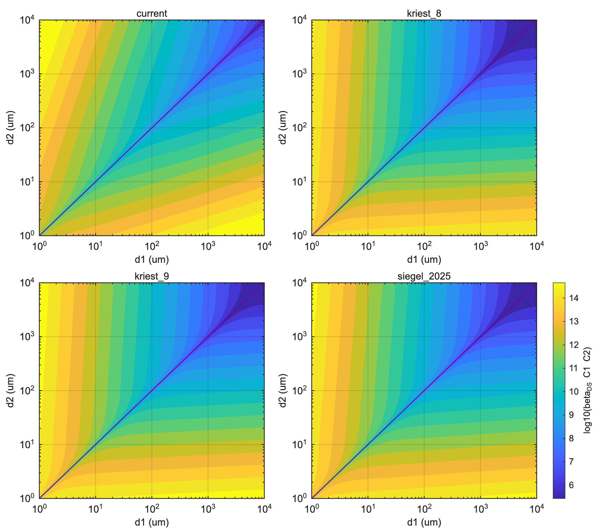
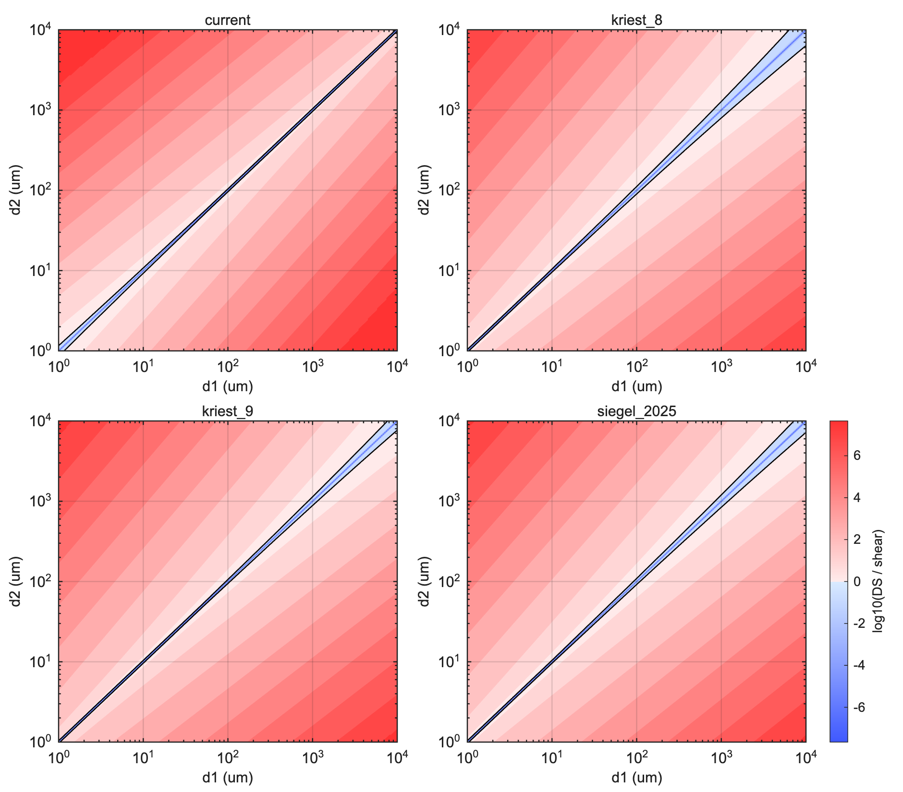
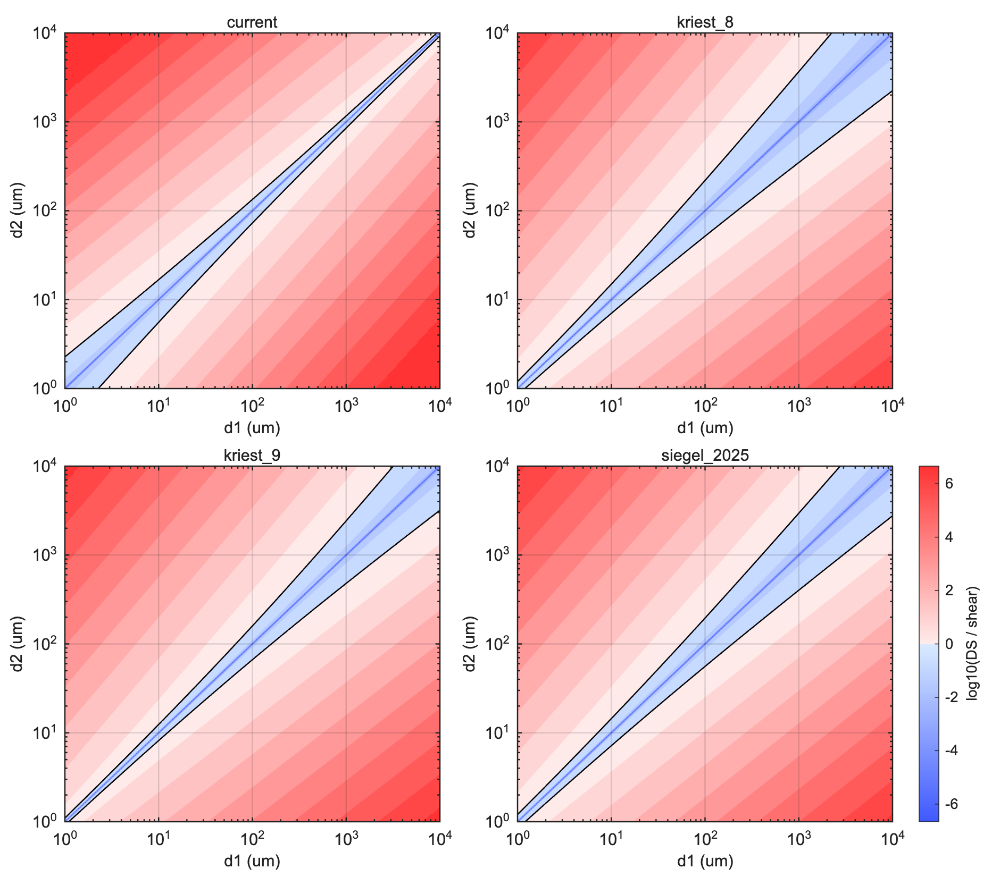

# Report - Apr 09, 2026 - Sinking-speed interaction checks

This is an internal research note, not a paper draft. The aim here is narrower than a full results write-up. I want to show what I checked, how to read the figures, what I think the figures support, and where I am still not fully sure.

These checks came from one practical question. Some of the later interaction-style plots looked more alike than I expected, even though the raw sinking-speed laws looked quite different. So I went back to the simpler pieces first: settling speed, the differential-settling kernel, concentration weighting, and the comparison with turbulent shear.

## Questions

**Sinking speed representation**

What does the sinking speed as a function of size look like as I increase the exponent in the sinking-speed relationship from `0.6` to `2.0` (`0.6`, `0.8`, `1.0` ...)?

How does the differential sedimentation `beta_DS` change for two particles, for example `1 um` colliding with particles from `1 um` to `1 cm`, and then `1 mm` with particles from `1 um` to `1 cm`?

If I include particle concentrations, how does the interaction change when I use `beta_DS * C1 * C2`, for example with `C = 10^3 * d^-2.5`?

How does `beta_DS * C1 * C2` compare with `beta_shear * C1 * C2` for the different sinking-speed laws and different turbulent dissipation rates?

## Notation used below

I use the following notation throughout:

- `d1`, `d2` for the two particle sizes in one pair
- `w1 = w(d1)` and `w2 = w(d2)` for their sinking speeds
- `beta_DS` for the differential-settling kernel
- `beta_shear` for the turbulent-shear kernel
- `C1 = C(d1)` and `C2 = C(d2)` for concentration weighting
- `epsilon` for turbulent dissipation rate

For the weighted differential-settling plots, I use

`I_DS = beta_DS * C1 * C2`

with

`C(d) = 10^3 d^-2.5`

and for the shear comparison I use

`I_shear = beta_shear * C1 * C2`

## Q1

### What does the sinking speed as a function of size look like as I increase the exponent in the sinking-speed relationship from 0.6 to 2.0?

I started with a very simple sweep,

`w = a d^b`

using the same `a` and several values of `b`. This is only a shape test. It is not meant to be the final settling physics. The point is to see what changes when only the exponent changes.

In this figure, the x-axis is particle diameter in `um` on a log scale. The y-axis is sinking speed in comparison units, also on a log scale, because `a` is fixed. So the figure should be read as a shape comparison, not an absolute-speed plot.

As `b` increases, the curve steepens. That widens the gap between small and large particles. Small particles become relatively slower, while large particles become relatively faster. Since differential sedimentation depends on `|w1 - w2|`, that change in slope should matter later.

I then checked the named settling laws that are already used in the repo.

This figure uses the same x-axis, particle size in `um`, but now the y-axis is sinking speed in `m/day`. Both axes are on log scales. The `current` law pulls away much more strongly at the large-size end. `kriest_8`, `kriest_9`, and `siegel_2025` still differ, but over much of the size range they stay closer to one another than to `current`.

What I take from Q1 is simple. The settling law already matters before any kernel is calculated. In particular, the `current` law should create the largest settling-speed contrasts once large particles are involved.

## Q2

### How does the differential sedimentation `beta_DS` change for two particles, for example 1 um colliding with particles from 1 um to 1 cm, and then 1 mm with particles from 1 um to 1 cm?

For this part I used

`beta_DS = (pi / 4) (d1 + d2)^2 |w1 - w2|`

This kernel has two parts. The term `(d1 + d2)^2` is the collision-size part. The term `|w1 - w2|` is the settling-speed contrast. So `beta_DS` is small when the particles settle at nearly the same speed, and larger when the pair is both bigger and more separated in speed.

I first fixed `d1 = 1 um` and varied the partner size `d2` from `1 um` to `1 cm`.

Here the x-axis is the partner size `d2` in `um`. The y-axis is a relative `beta_DS` comparison from the simple exponent sweep, so the shape matters more than the absolute number. For such a small fixed particle, `beta_DS` grows as `d2` gets larger. That comes from both pieces of the kernel: the collision geometry grows and the settling-speed gap grows.

The middle case, `d1 = 500 um`, makes the low-`beta_DS` region easier to see.

When `d2` approaches `d1`, the two particles settle at more similar speeds, so `|w1 - w2|` becomes small. That is why the curves dip there. It is a real feature of the kernel, not a plotting issue.

The same pattern stays in the `d1 = 1 mm` case.

Again, the x-axis is the partner size `d2` and the y-axis is relative `beta_DS`. The low region marks pairs with similar settling speeds. Away from that region, `beta_DS` rises. The higher exponents push the large-size side up more strongly because they create larger speed contrasts there.

I also looked at the full size-size maps for the named laws.

In these four panels, both axes are particle size, plotted as `log10` size in `um`. The color shows the beta-only kernel strength. The pale band near the diagonal is the low-`beta_DS` region where the two sizes settle at similar speeds. Away from that band, the kernel becomes stronger. The main difference is that the `current` law stretches the high-`beta_DS` region more strongly toward the larger-size side.

So the message from Q2 is still the same across all views. `beta_DS` stays small when the settling speeds are similar and grows away from that region. The `current` law does not change that basic structure, but it makes the large-size contrast stronger.

## Q3

### If I include particle concentrations, how does the interaction change when I use beta * C1 * C2, for example with C = 10^3 * d^-2.5?

This is the point where the story changes. The beta-only plots tell me where interactions are possible. They do not yet tell me which parts of size-size space matter most once the particle field is uneven.

To include that, I used

`I_DS = beta_DS * C1 * C2`

with

`C(d) = 10^3 d^-2.5`

In these panels, the two axes are again the two particle sizes, shown as `log10 d1` and `log10 d2` in `um`. The color shows the concentration-weighted differential-settling interaction strength. This is the same size-size space as the beta-only maps, but now the map is weighted by how many particles exist at those sizes.

That weighting shifts the emphasis quite a lot. With a `d^-2.5` concentration law, small particles are far more common than large ones. So even when raw `beta_DS` is strong in the large-large corner, that part of the map may matter less than a smaller-size region where particle pairs are much more abundant.

This is why the weighted maps can look more similar than the beta-only maps. The weighting pulls attention toward the smaller-size region, and in that part of the grid the non-`current` laws are already closer. I do not read that as “the laws become the same.” I read it as “the concentration field changes which part of the kernel matters most.”

## Q4

### How does `beta_DS * C1 * C2` compare with `beta_shear * C1 * C2` for the different sinking-speed laws and different turbulent dissipation rates?

For this part I compared the weighted differential-settling rate with the weighted turbulent-shear rate and then plotted the ratio

`I_DS / I_shear`

In these ratio maps, both axes are again particle size pairs. The color is `log10(I_DS / I_shear)`. Warm colors mean differential sedimentation is stronger there. Cool colors mean turbulent shear is stronger there.

At low turbulence, `epsilon = 1e-8`, differential sedimentation is stronger across a large part of the map.

At `epsilon = 1e-6`, the warm region shrinks and shear becomes more competitive.

At `epsilon = 1e-4`, the shear-dominated region grows further.

So the settling-law question is only part of the answer. The turbulence level matters a lot as well. At low `epsilon`, differential sedimentation can dominate over much of the weighted size-size space. As `epsilon` rises, that region contracts. The `current` law still tends to keep the strongest differential-settling signal because it gives the largest settling-speed contrasts.

