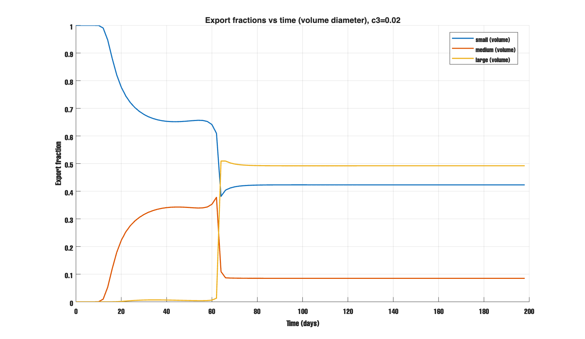
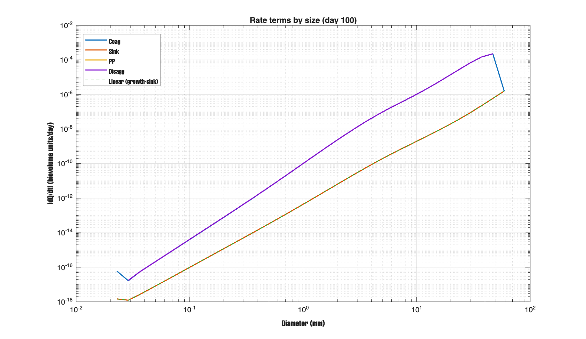

# Coagulation Model (0-D): Budget check + Export Diagnostics 

## Configuration Used (i have treid with multiple values and found that this one suits better)
- Disaggregation strength: `c3 = 0.02`, size scaling: `c4 = 1.45`
- Geometry: `r_to_rg = 1.6`
- Sinking law: `kriest_8`
- Budget diagnostics output step: `delta_t = 0.25` (dt sensitivity shown below)

I added a budget check that tracks total particle volume over time and measures any mismatch (the residual).
I turned disaggregation back on and reported how much it removes overall (treating it as a loss).
I reran the budget check with a smaller output time step (OFF-only) to see how much of the residual is just numerical error.
I tried the main "knobs" that control what sizes get exported (especially r_to_rg) and picked a stable set of settings that give the export pattern we want.

- With disaggregation turned on, the model's volume budget closes much better; with it off, the remaining mismatch is mostly numerical and gets smaller when we use a finer output time step.

- With the chosen settings (c3=0.02, r_to_rg=1.6), export is not dominated by only small particles anymore: medium and large particles contribute a substantial fraction of export, and the pattern stays stable through time.

### Figure 1 - Integrated mass-balance residual (OFF vs ON), `c3=0.02`
turning disaggregation ON makes the biovolume budget consistent (orange ~0), while OFF leaves a  mismatch(blue deviates from 0).

### is the "budget error" we see with Disagg OFF a real physical problem, or mostly a numerical artifact from using a coarse output time step (dt)?

the Disagg OFF "budget error" is partly an artifact of using dt=1; using dt=0.25 reduces it, so we should trust the finer‑dt budget numbers more

### what fraction of the exported material is small vs medium vs large?
 with this configuration, export is not only small particles—a persistent ~20% of export is in the large class (by image diameter), and the split becomes stable after the initial adjustment period.

## Export fractions vs time (volume diameter)
the model is producing particles that, in terms of mass/volume, behave like large aggregates (so large export is ~50%), even though their image size classification spreads them more into small/medium. 

### who is driving change?
By day 100, the model is in a regime where large particles are being strongly "pushed down" by disaggregation (or loss), while sinking and coagulation are weaker in comparison at the very top end.
That helps explain why export fractions stabilize: large particles are produced (coagulation) and removed (sinking + disagg), and disagg becomes the main "brake" at the biggest sizes.

