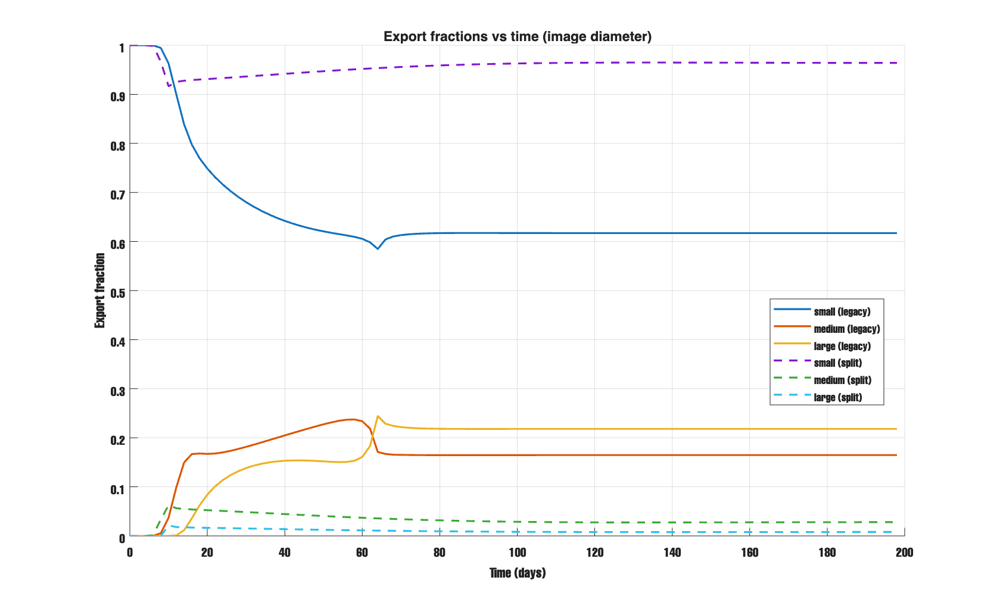
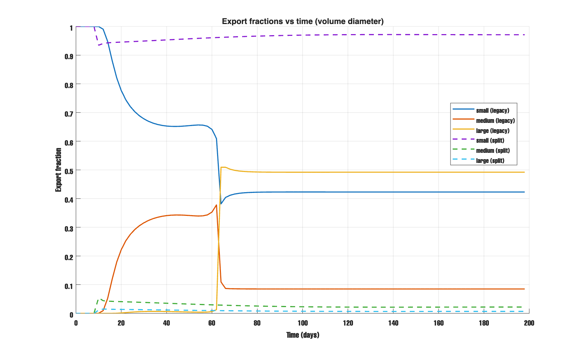
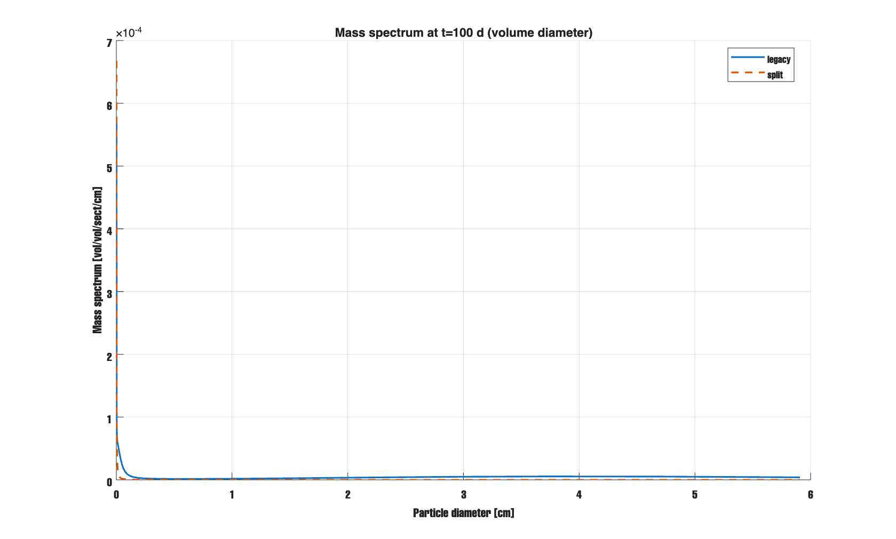
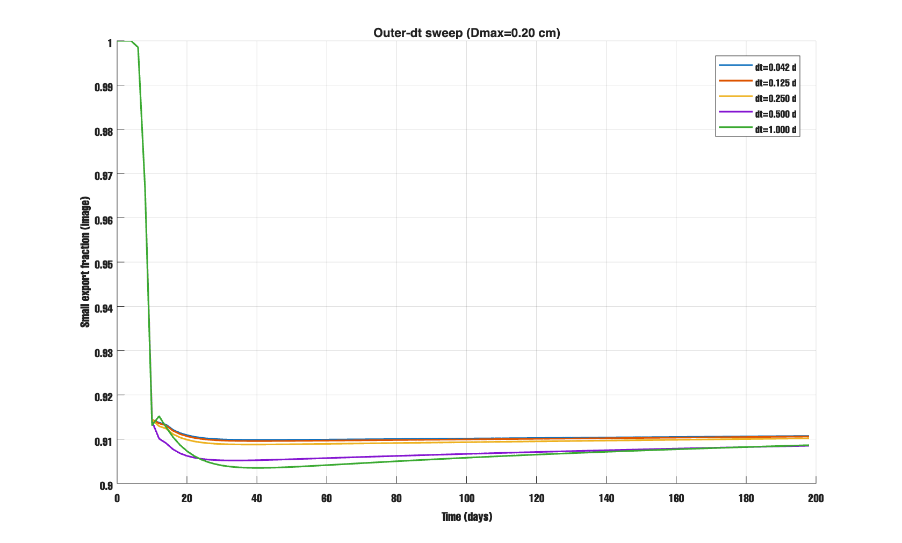
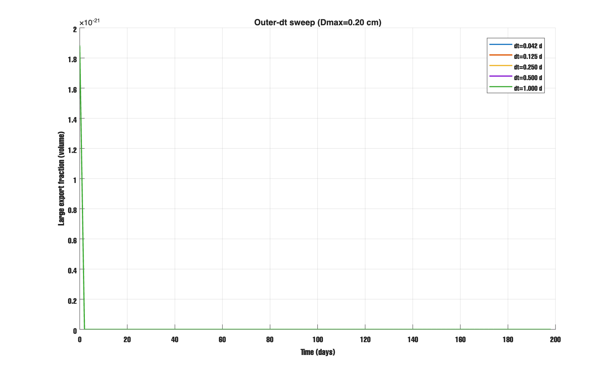

# Coagulation Model — Feb 10, 2026 

## What I Tested
- Implemented operator‑split disaggregation (ResetInitialCond logic) and kept legacy disaggregation for comparison.
- Compared export fractions and size spectra: legacy vs operator‑split.
- Swept outer timestep (1 hr → 1 day) with a small `Dmax` to force the cap.

## What I Found
- Operator‑split strongly shifts export to small size classes in 0‑D.
- Changing `Dmax` or the outer timestep had only minor impact on export fractions.
- The operator‑split behavior is very different from legacy in 0‑D, so it likely needs evaluation in 1‑D where epsilon varies with depth.

## Figures 

Legacy vs operator‑split export fractions using **image diameter**.  
Operator‑split stays very small‑dominated.  

Legacy vs operator‑split export fractions using **volume diameter**.  
Legacy shows large export at late time; operator‑split does not.  

Mass spectrum at day 100 (volume diameter).  
Operator‑split suppresses the large‑size tail.  

Outer‑timestep sweep: **small export fraction (image)**.  
Changing outer timestep does not move the curves much.  

Outer‑timestep sweep: **large export fraction (volume)**.  
Large export remains near zero across outer‑dt values.  

