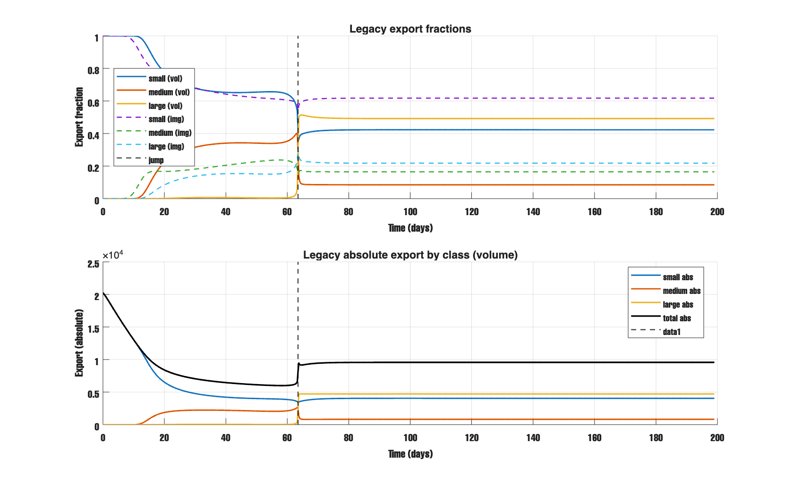
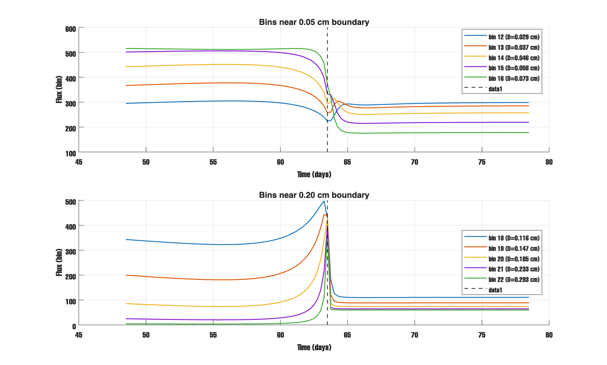
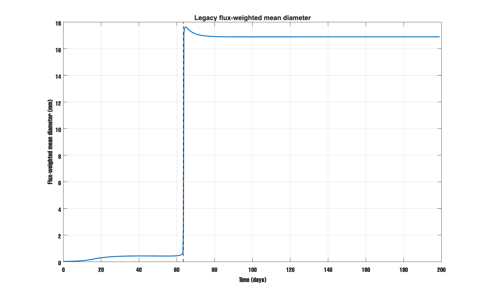
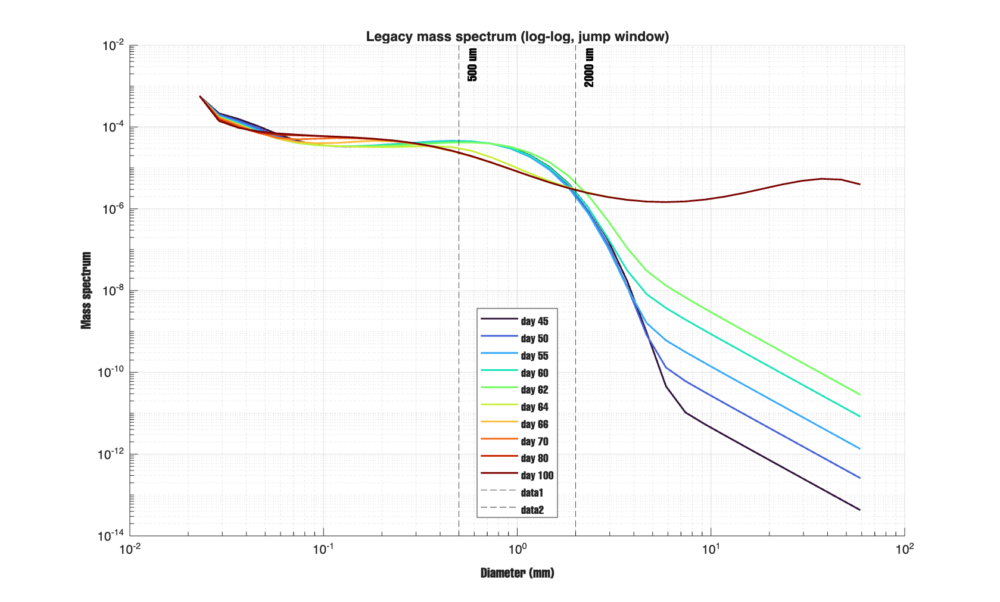
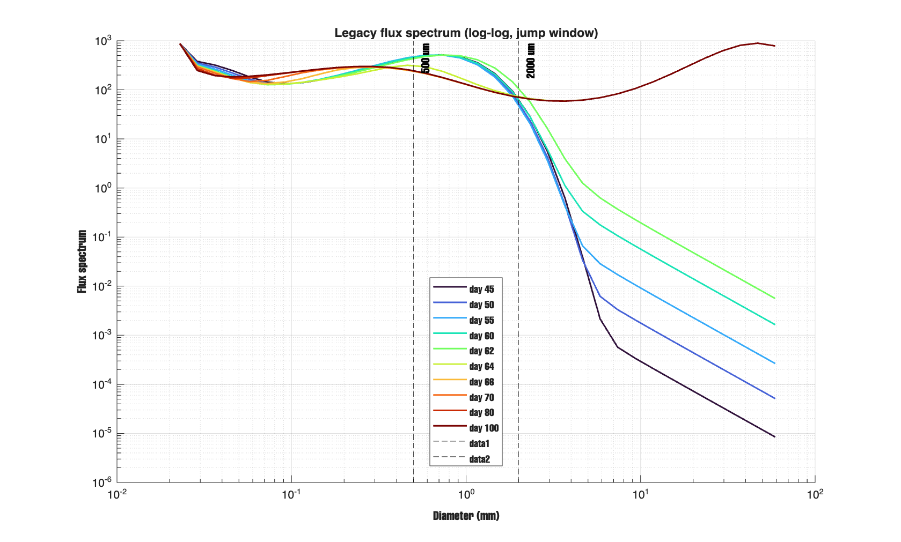
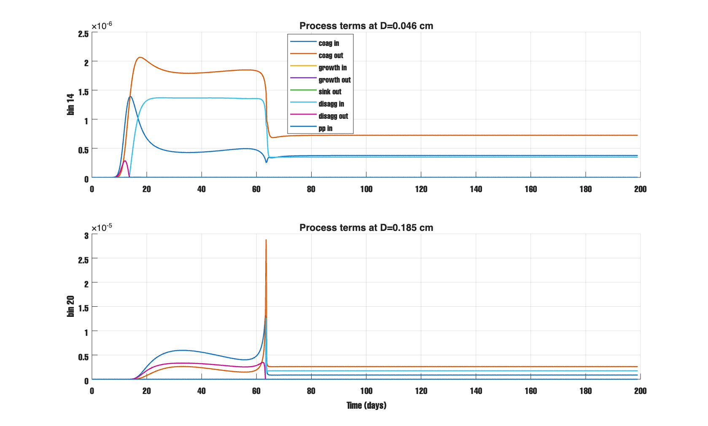
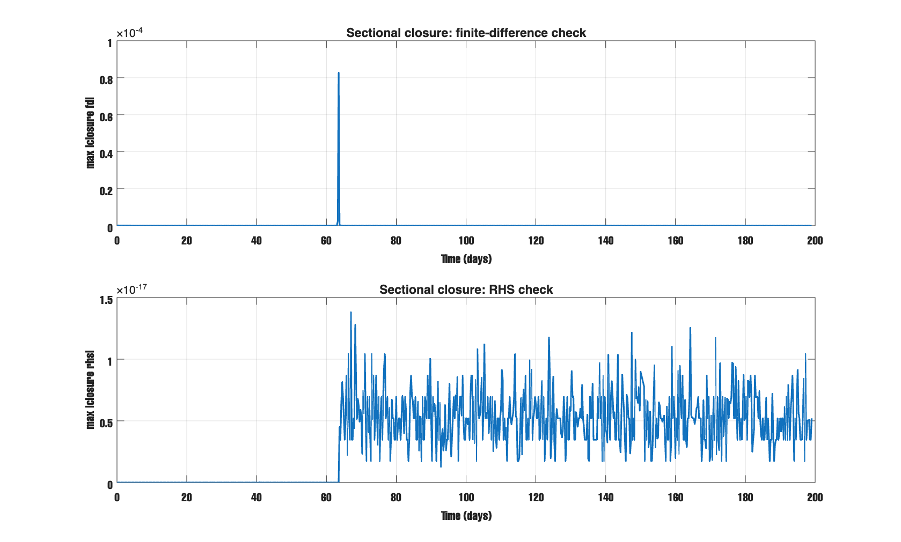
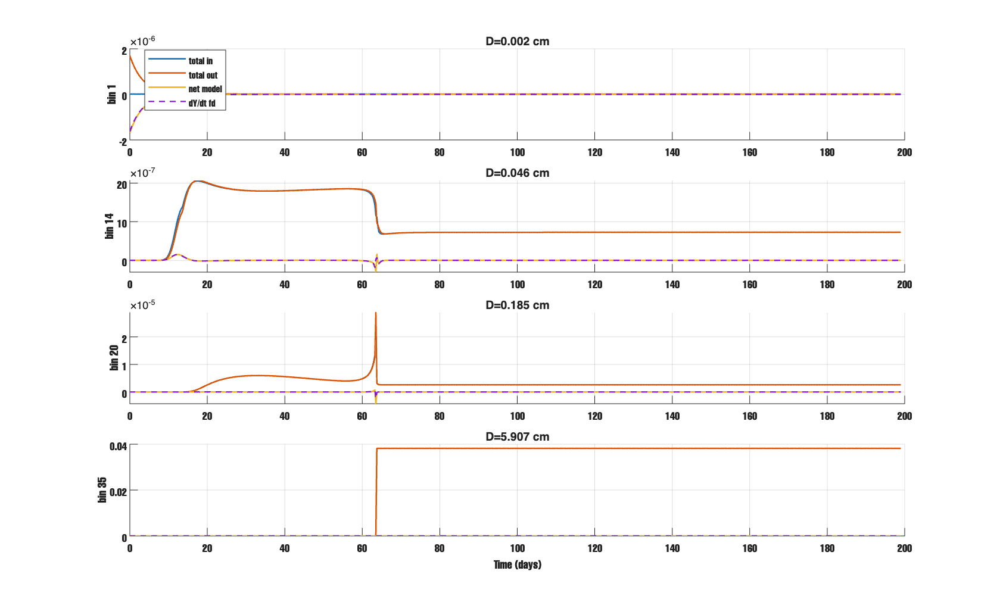

# Report - Feb 18, 2026 

## What I checked
1. Why legacy has a sudden jump near day 63.
2. Log-log plots for size and flux.
3. Sectional mass balance (what goes in and out of each bin).

### the peak?
old model has a sharp jump at **63.25 -> 63.50 days**.

- Before jump: `small=0.537, medium=0.401, large=0.062`
- After jump: `small=0.416, medium=0.292, large=0.292`
- Total export also jumps: `6.56e3 -> 8.23e3`

So i think this is not only a fraction-plot effect.

At that time, bins near the 0.2 cm class boundary change very fast.
Mass moves quickly to larger bins, and large particles sink/export much faster.
That creates a sudden shift in export classes.

## figures 

This plot shows the jump in both fraction and absolute export.  

These bins show the fast transition near 0.05 cm and 0.2 cm boundaries.  

Mean export size jumps from about 0.5 mm to about 17 mm near day 63.5.  

Mass spectrum in log-log view around jump window.  

Flux spectrum in log-log view around jump window.  

Process terms show how in/out terms change in key boundary bins.  

Closure summary shows very small RHS residuals.  

Selected bins: total in/out and dY/dt mostly match, with spike near jump time.  

