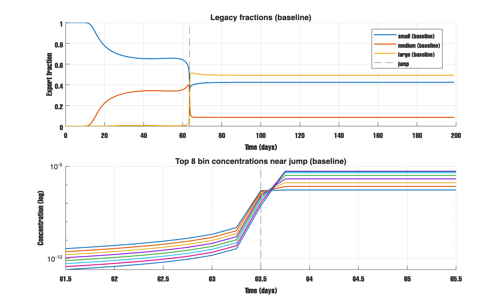
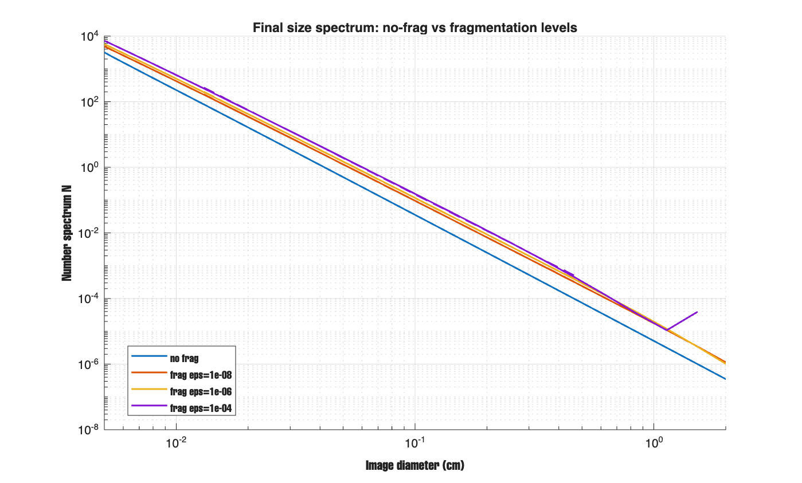
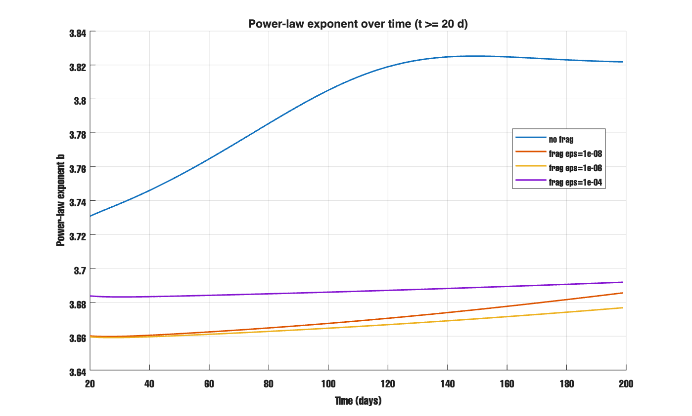
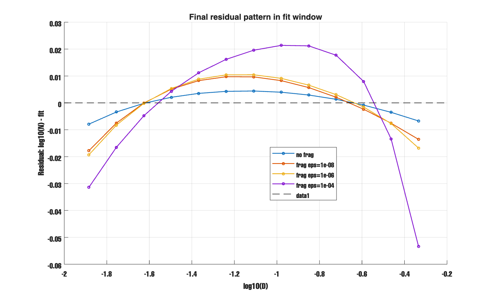
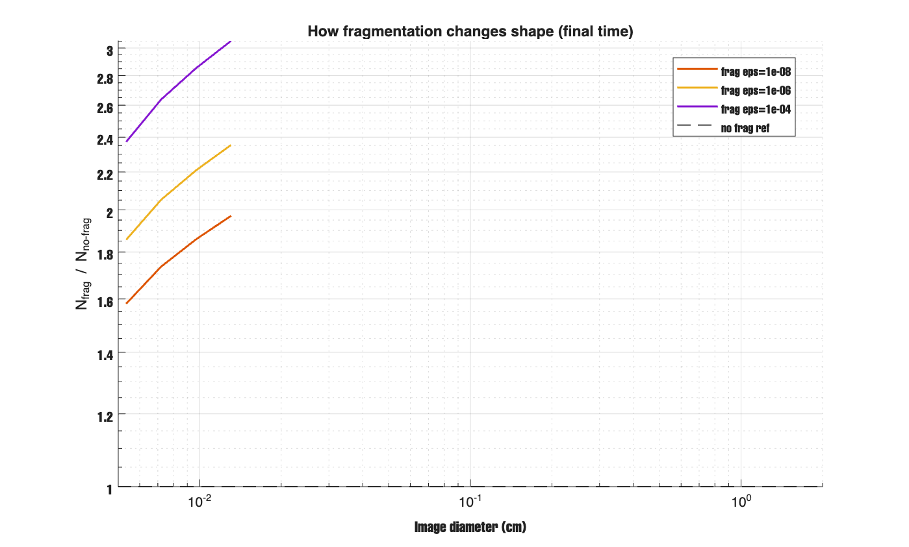
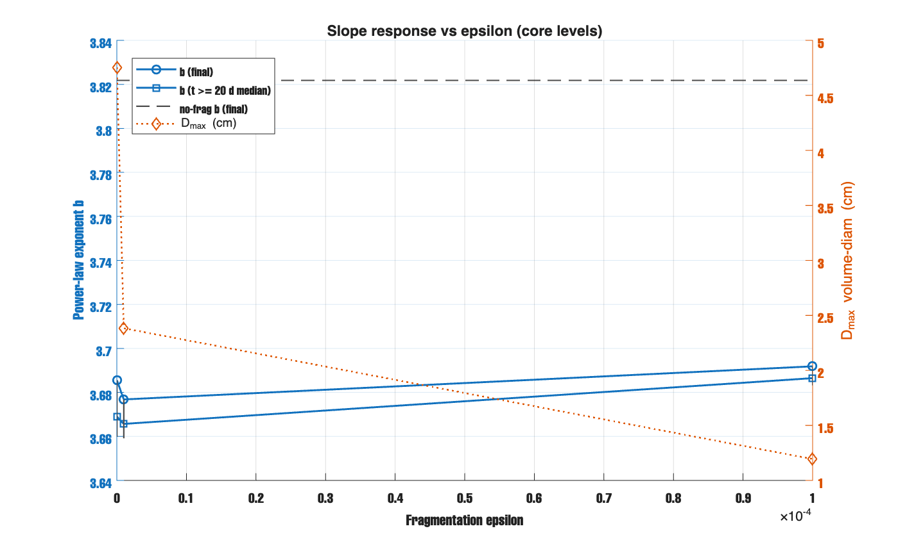
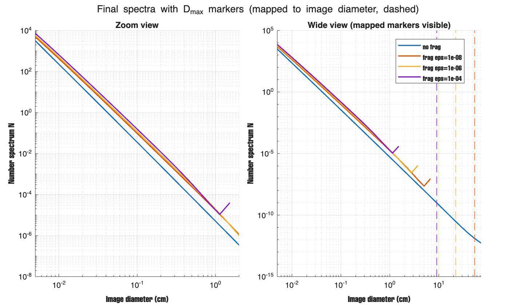
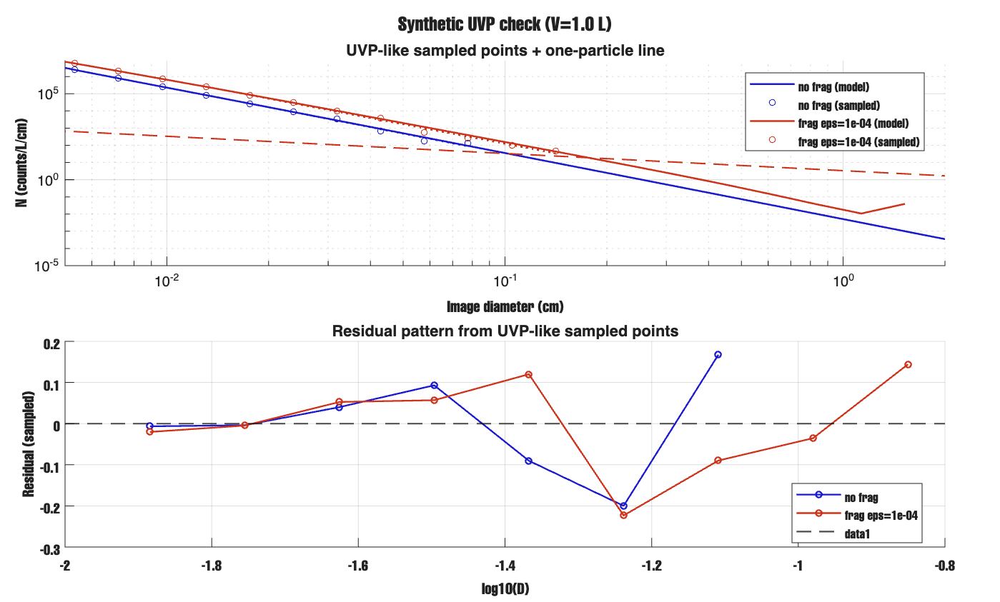
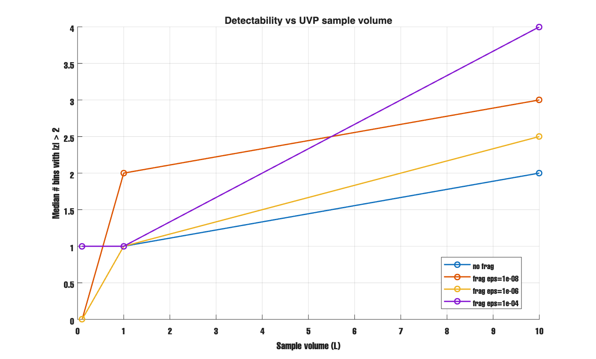

# Report - Mar 2, 2026

## What I checked
1. Checked the day-63 jump again (real model change or just plot effect).
2. Built a no-frag power-law baseline.
3. Ran 3 frag levels: `eps=1e-8, 1e-6, 1e-4`.
4. Compared slope change vs `epsilon`.
5. Checked `Dmax` marker location on image-diameter plots.
6. Re-checked UVP style detectability with Poisson + sample volume.

### what we tested
First i tuned sinking so no-frag gives a clean straight line in log-log space.
Then i changed only fragmentation level and kept other settings same.
I compared spectra, slope, residual shape, and frag/no-frag ratio.
I also fixed the marker issue: `Dmax` formula is in volume size, but the plot uses image size.
So i mapped `Dmax` to image bins and added a wide-view panel.

### what we find
- No-frag case is a very clean power-law line.
- Frag cases are also close to power law, but shape changes a bit.
- Slope changed, but not by a huge amount (`b` roughly from `3.68` to `3.82`).
- Stronger frag gives stronger bend in residual plot (`eps=1e-4` is strongest).
- `Dmax` marker problem is now clear:
  - mapped markers are far right on image axis (`9.08`, `22.17`, `54.12` cm),
  - so they are mostly outside the zoom range (`<= 2 cm`).
- Day-63 jump is still real behavior, not a NaN crash.
- UVP test still shows: larger sample volume makes signal easier to detect.

### confusing?
- There is still a right-tail uptick around `~1 to 1.5 cm`.
- But mapped `Dmax(img)` is much farther right, so this uptick is likely not direct `Dmax` cutoff.
- Slope change across 4 orders of `epsilon` is small.
- So maybe slope alone is not enough, and residual shape may be a better signal.

## figures

Day-63 jump check. It shows the jump is real!!!  

Final spectra for no-frag and 3 frag levels. Lines are close, but not identical.  

Slope over time after startup (`t >= 20 d`). No-frag stays higher than frag runs.  

Residual pattern in fit window. Strongest bend is for `eps=1e-4`.  

Frag/no-frag ratio.i think empty area is from masking very small no-frag bins.  

Slope response vs `epsilon` with `Dmax` in volume-diameter units.  

Dmax markers mapped to image diameter: left is zoom, right is wide view.  

UVP-style sampled check 

Detectability vs sample volume (`|z| > 2` bins): larger volume gives clearer signal.  

