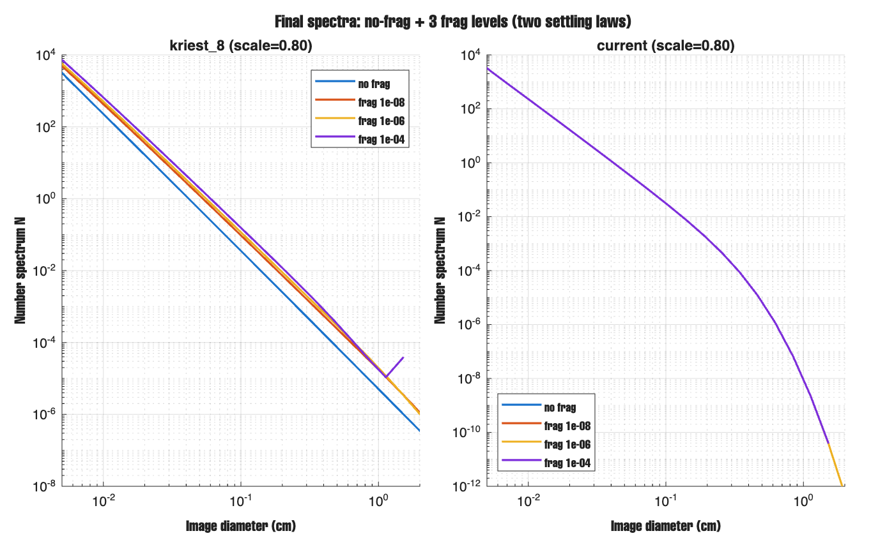
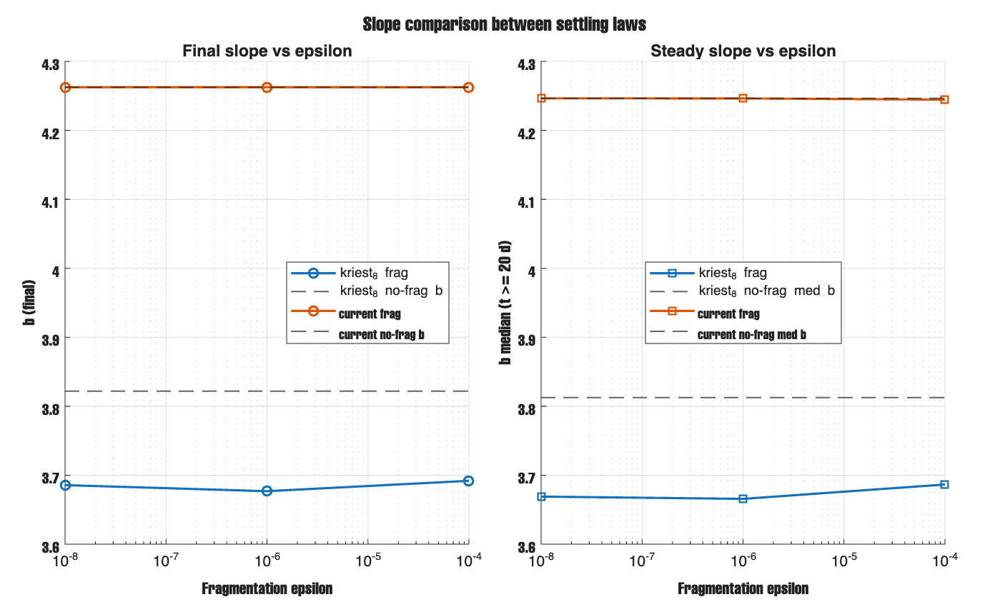
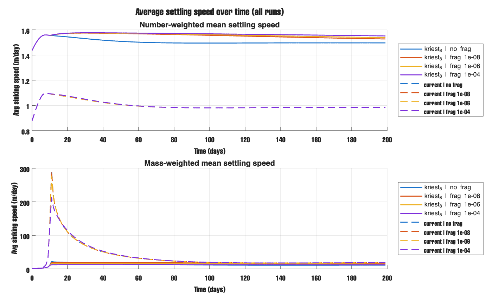
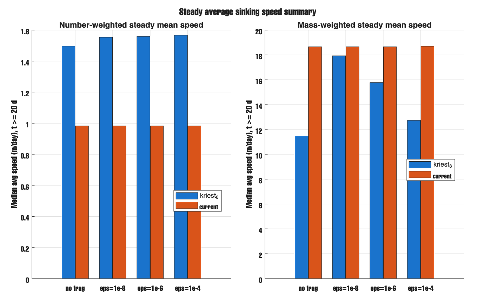

# Report - Mar 3, 2026

## result
I compared two settling laws: `kriest_8` and `current`, with no-frag and three frag levels (`1e-8, 1e-6, 1e-4`).
For `kriest_8`, fragmentation changed slope and spectrum shape (`b` moved from about `3.82` to about `3.68-3.69`).
For `current`, slope stayed almost the same (`b` about `4.26` for all frag levels), so frag signal is weak in this setup.
I tracked average sinking speed over time for all runs (number-weighted and mass-weighted).
Steady number-weighted speed is about `1.5 m/day` for `kriest_8` and about `0.98 m/day` for `current`.
Steady mass-weighted speed is higher for `current` (about `18.7 m/day`) and has a strong early spike.

## figures

Final spectra for both settling laws (no-frag + 3 frag levels).  

Slope vs epsilon for both settling laws.  

Average sinking speed over time for all runs.  

Steady average sinking speed summary.  

