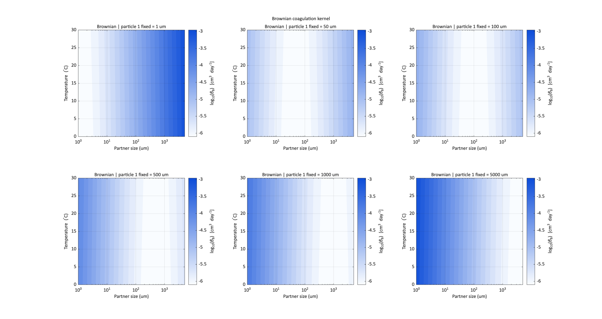
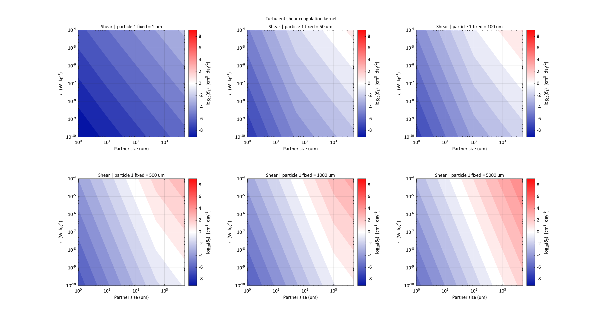
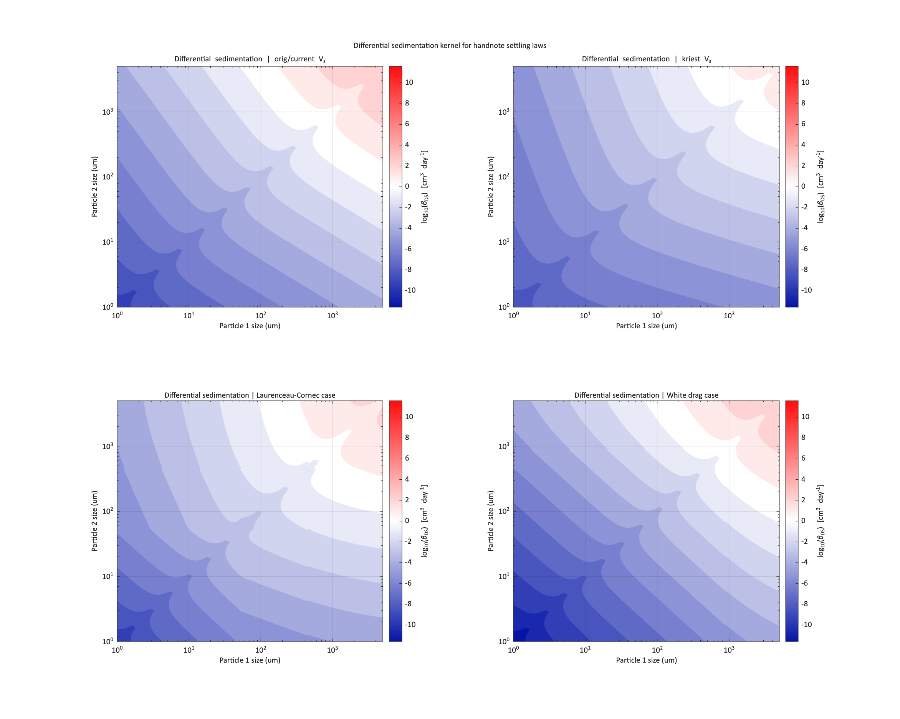
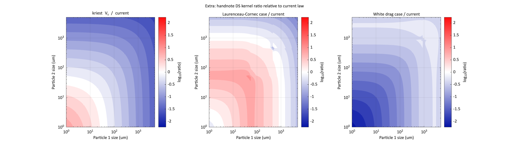
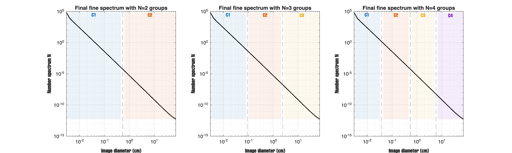
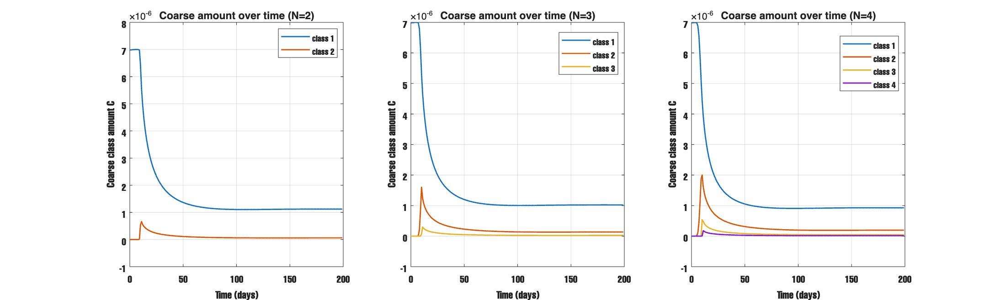
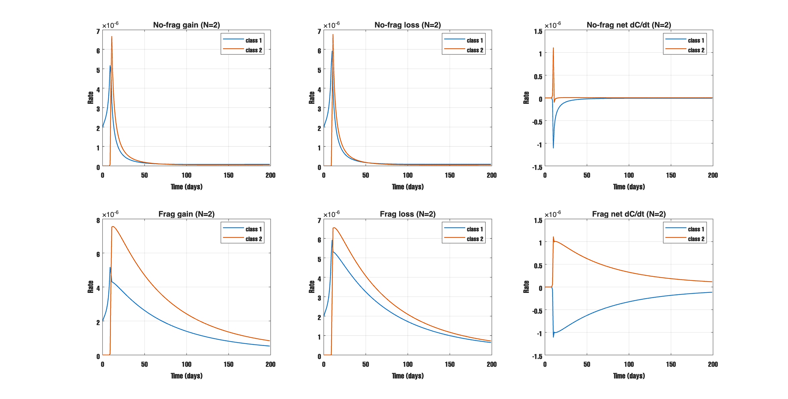
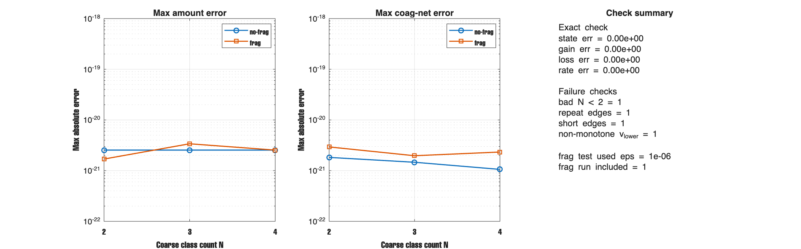

# Report - Mar 9, 2026

## what i tested
- Brownian, shear, and differential sedimentation kernel plots.
- compared different settling-speed cases for differential sedimentation.
- grouped the fine spectrum into `N=2`, `N=3`, and `N=4` coarse classes.
- checked conservation for no-frag, one frag case (`eps=1e-6`), and one exact check.

## what is the code to check
- `run_kernel_contour_gallery.m`
- `run_size_class_general_diagnostic.m`
- `size_class_general.m`

## what i found (result)
- Brownian changes more with size than with temperature in this setup.
- Shear gets stronger when partner size and `epsilon` get larger.
- Differential sedimentation changes a lot with the settling-speed case.
- The coarse grouping works well for `N=2`, `N=3`, and `N=4`.
- Amount and coagulation net rate stay conserved at machine-level error (`~1e-21`).
- The exact check gives zero error, and the bad input checks fail correctly.

## figures
Brownian kernel. This shows the kernel changes more with size than with temperature here.

Shear kernel. This shows the kernel gets stronger when size and `epsilon` get larger.

Differential sedimentation comparison. This shows the settling-speed case changes the kernel pattern a lot.

Differential sedimentation ratio to the `orig/current` case. This shows where the other settling-speed cases are stronger or weaker.

Grouped final spectrum for `N=2`, `N=3`, and `N=4`. This shows how the fine bins are merged into larger classes.

Coarse class amount over time. This shows the grouped classes still give a smooth and physical time evolution.

Coagulation gain, loss, and net rate for a simple grouped case. This shows how material moves into and out of the coarse classes.

Conservation summary. This shows the amount and rate errors stay at machine level, and the exact check gives zero error.

