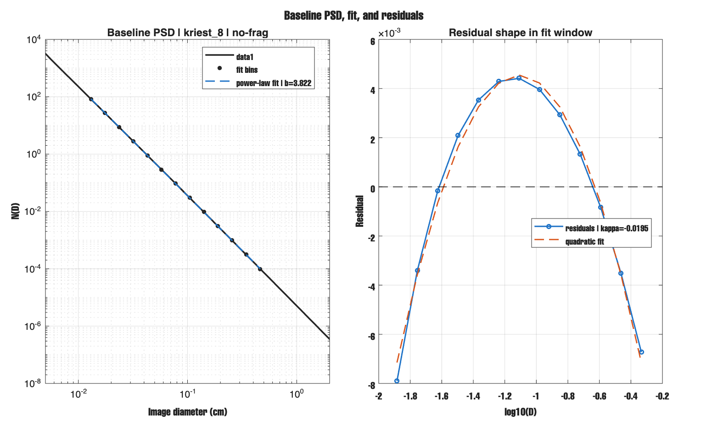
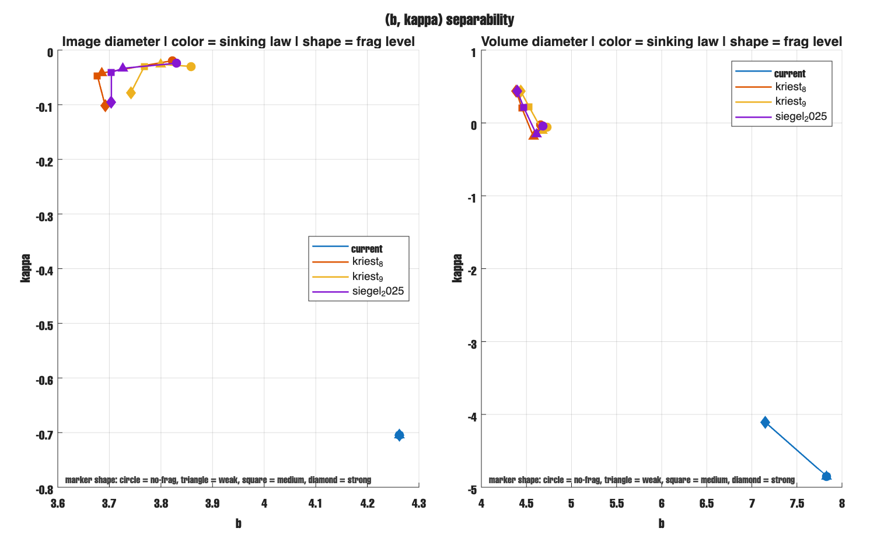
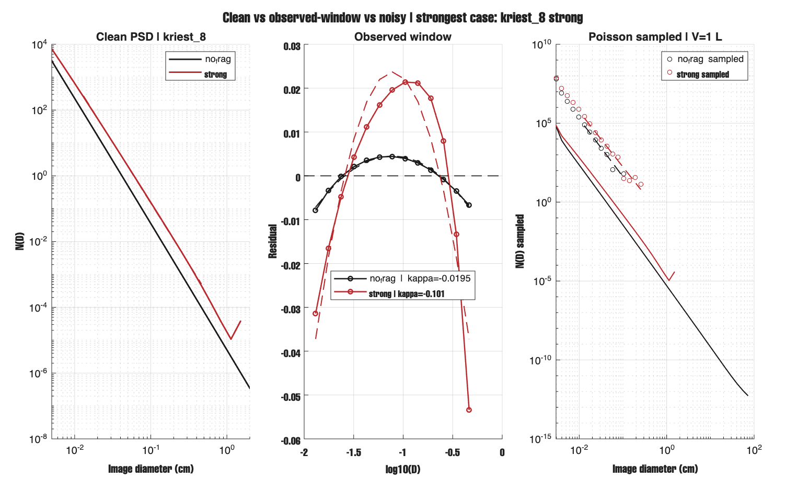
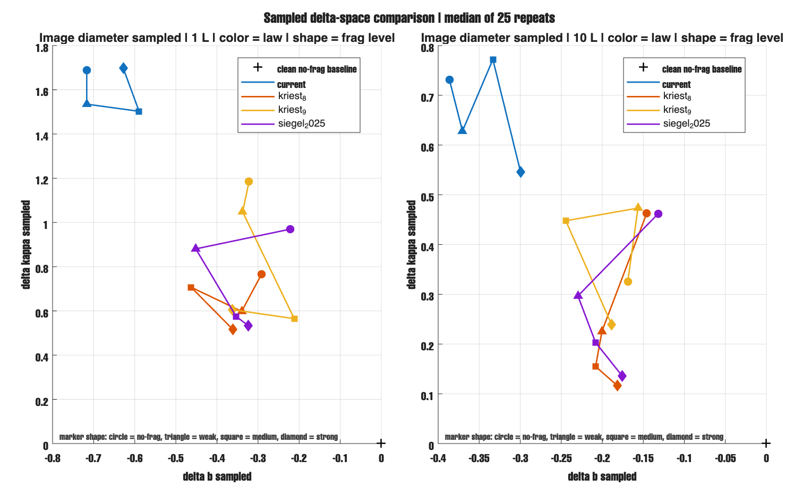

# Report - Mar 15, 2026

## the question i had while working on the model

While i was working on the size-resolved marine particle **box model**, i kept thinking about one question:

**Can PSD shape show fragmentation/disaggregation even when PSD slope does not change much, and when sinking-law choice is uncertain?**

To check this, i made a small analysis using the current box model. I did not change the core physics.

I ran:

- 4 fragmentation levels:
  - `no_frag`
  - `weak`
  - `medium`
  - `strong`
- 4 sinking laws:
  - `current`
  - `kriest_8`
  - `kriest_9`
  - `siegel_2025`
- image diameter and volume diameter
- UVP-like Poisson sampling

I compared:

- slope `b`
- residuals from the power-law fit
- curvature `kappa`

## first, i checked if the baseline PSD is clean

Before asking anything about fragmentation, i first checked whether the no-frag PSD is simple enough to use as a baseline.

This figure shows the no-frag case for one reference law (`kriest_8`). The PSD is close to a straight power law, but the residual plot still has shape. That means slope alone is already not the whole story.

## then, i asked if the raw metric space separates the cases

I first looked at the raw `(b, kappa)` space.

This already shows something important:

- `current` behaves differently from the other laws
- the other 3 laws move more with fragmentation
- but the raw plot still mixes baseline differences among sinking laws

## then, i removed the no-frag baseline of each law

This was the clearest step.

Instead of looking at raw `b` and raw `kappa`, i looked at:

- `delta b`
- `delta kappa`

relative to each law's own no-frag case.

This figure is the strongest one right now because it removes the large baseline offset among sinking laws and shows only the fragmentation response.

What it shows:

- for `kriest_8`, `kriest_9`, and `siegel_2025`, fragmentation moves the cases away from the no-frag point more clearly in `kappa` than in `b`
- `current` still behaves differently and keeps the image-space signal weak
- volume diameter gives a cleaner fragmentation signal than image diameter

One clear example:

- `kriest_8 no_frag`: `kappa = -0.0195`
- `kriest_8 strong`: `kappa = -0.1013`
- `delta kappa = -0.0819`

## then, i asked what happens in something closer to what we observe

The clean model result is useful, but the real question is whether the signal survives after:

- the observed size window
- and sampling noise

This figure shows one strong case in three steps:

- clean PSD
- observed-window residual view
- noisy sampled PSD

It shows that the signal is still there in the clean case, but it gets weaker after sampling.

## finally, i checked if larger sample volume helps

I compared sampled metric space at:

- `1 L`
- `10 L`

This shows:

- `10 L` is better than `1 L`
- but even `10 L` does not fully recover the clean metric space

So sampling matters a lot, and this should be framed as an **observability / detectability** result, not as a claim that fragmentation is always easy to diagnose.

## main result

- `b` alone is not enough
- `kappa` helps more for `kriest_8`, `kriest_9`, and `siegel_2025`
- `current` can hide the signal in image space
- volume diameter gives a cleaner signal than image diameter
- noise weakens the signal strongly

