# Report - Mar 22, 2026

Before, i was thinking:

**can PSD shape show fragmentation better than slope alone?**

Now i am asking:

**what part of an observed PSD is real signal, and what part is only noise or sampling?**

So this note is a short story of that.

## 1. the clean model still gives a clear signal

This is still my best starting point.

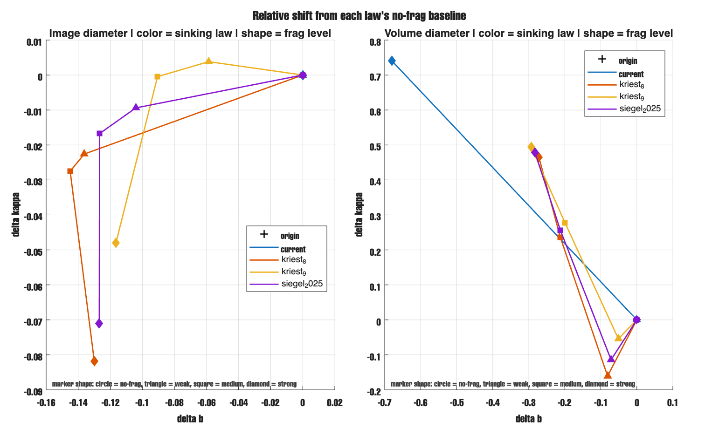

What i see here:

- `b` changes, but `kappa` helps more
- `kriest_8`, `kriest_9`, and `siegel_2025` look more clear than `current`
- volume diameter looks cleaner than image diameter

So my thought is shape contains useful information beyond slope.**

I also checked stickiness.

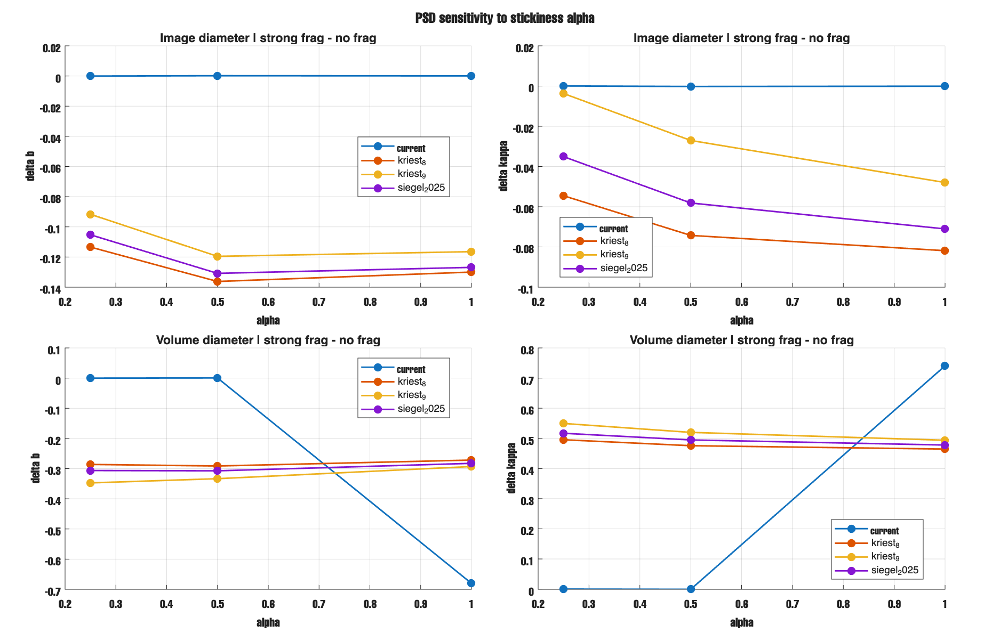

This says:

- for the krist and siegel laws, the fragmentation signal stays fairly stable across `alpha`

## 2. the UVP noise test as your real data!!

I took a real UVP-based mean PSD, fitted a power law, and then used that fitted law as the fake-data truth.

Then i added Poisson noise many times as you suggested. is that the way you did? i forget this part almost what you described. 

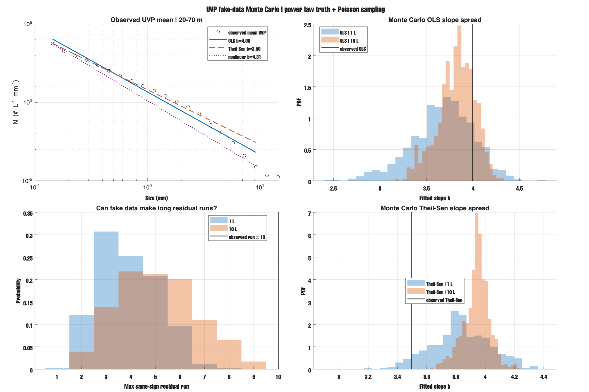

This figure says two simple things:

- fit method matters
- but the more important thing is the residual pattern

The long same-sign residual run is very hard to get from Poisson noise alone.

Then i checked several depth windows.

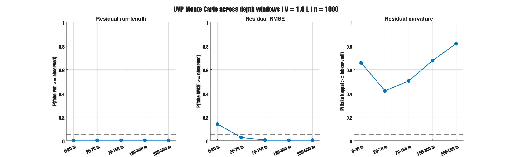

- run-length stays strong in every window
- RMSE also helps
- `kappa` is weaker than i first hoped

So this changed my thinking.

In clean model space, `kappa` looked very useful.
But in UVP-like observed space, **run-length looks more stable**.

I also checked depth-bin thickness.

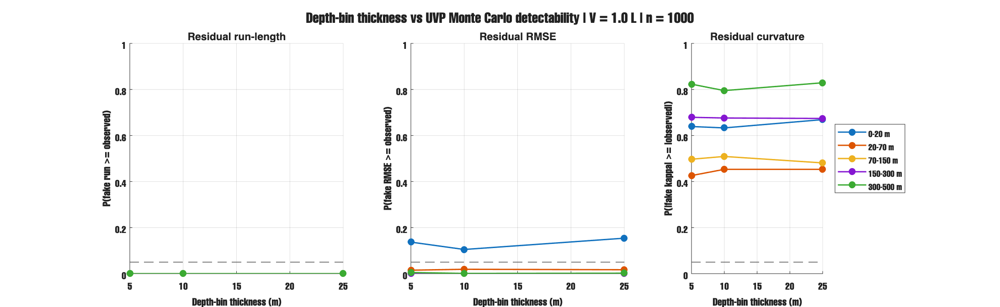

This says:

- bigger depth bins smooth the profile
- but they do not change the main answer very much

One open question is still sample effort.

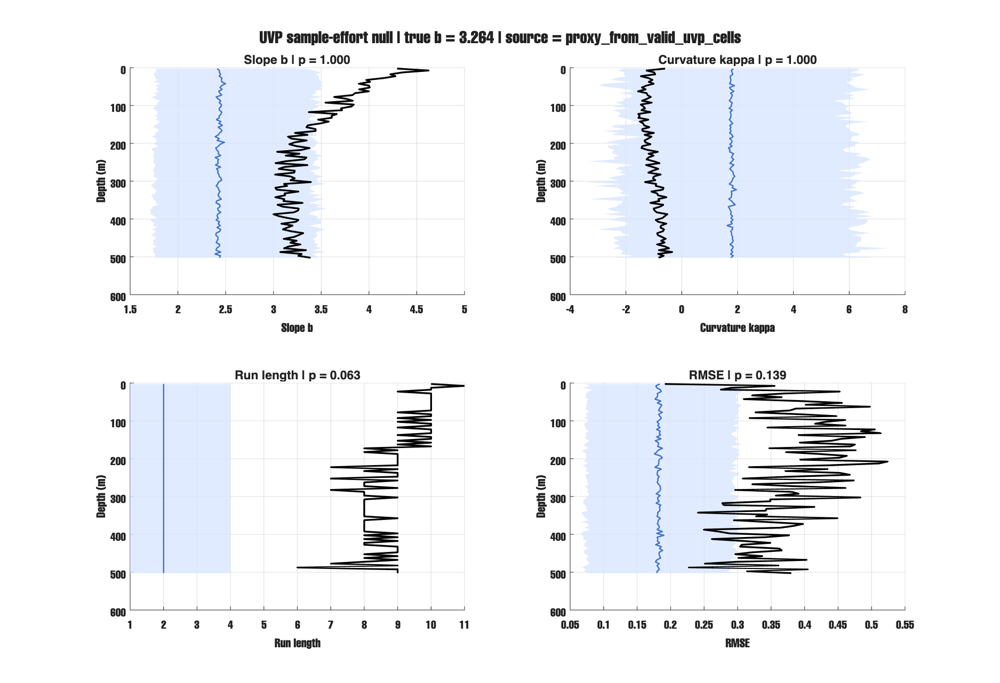

This part is still not final because i do not have the real image-count file yet.
But it suggests that some depth structure may come from effort only.

## 3. two figures are confusing, but they still help

These two figures are not clean proof figures.
They are more like warning figures.

### model PSD through a UVP-like observation step

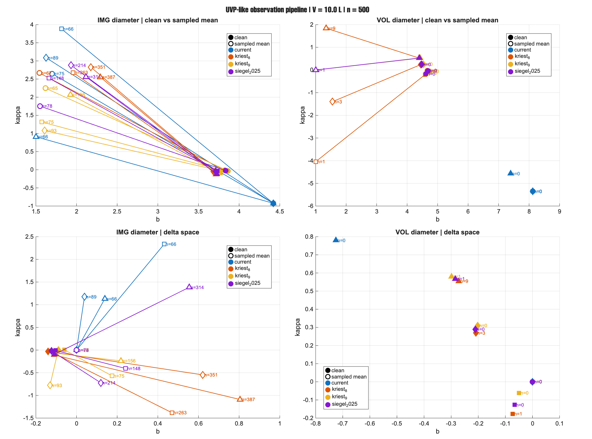

The confusing part is the **volume diameter** side.

I checked the code and the saved numbers.
This does **not** look like a simple code bug.

The main issue is that the expected counts are too small in volume space.
So most noisy volume fits fail.

Examples from the valid noisy volume fits:

- `current`: `0/500`
- `kriest_8`: at best `9/500`
- `kriest_9`: `1/500`
- `siegel_2025`: `1/500`

So the strange volume points mostly mean:

**the signal is not being recovered**

not:

**the noisy mean is very trustworthy**

So i keep this figure as a caution figure.

### stickiness versus fragmentation overlap

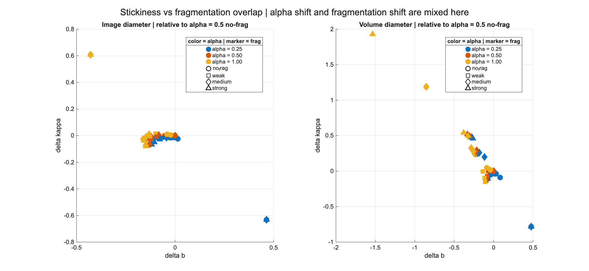

This figure is confusing for a different reason.

Here the delta is relative to `alpha = 0.5` no-frag.
So it mixes:

- alpha shift
- fragmentation shift

That is why it looks crowded.

My reading is:

- for `kriest_8`, `kriest_9`, and `siegel_2025`, the strong-frag points still stay in a fairly coherent group
- for `current`, alpha moves the result a lot, so fragmentation is more confounded there

So i keep this figure too, but also as a caution figure.

## 4. the kernel like the old one!

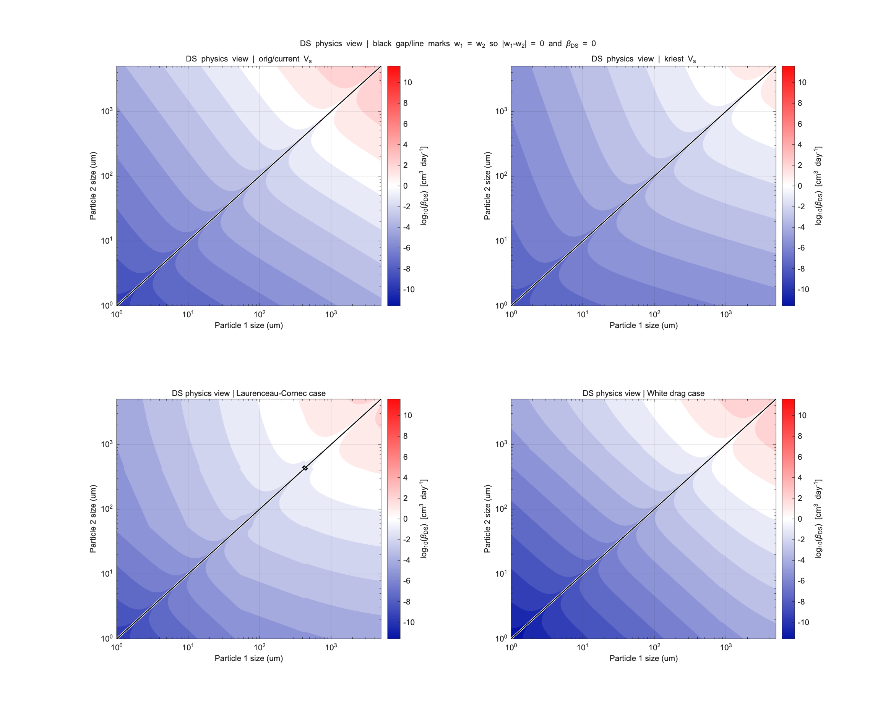

Then i made the sectional beta view.

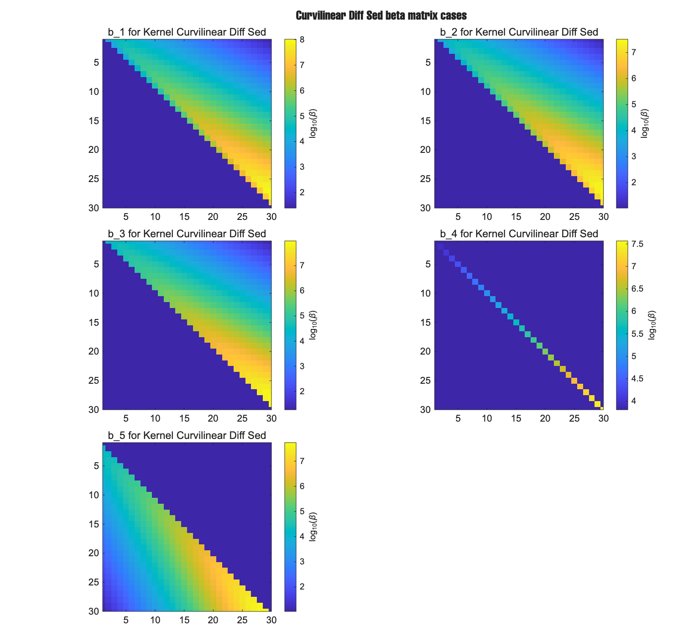

This helped because it shows where the interaction sits in the matrix.

Then i made the rate-weighted version too.

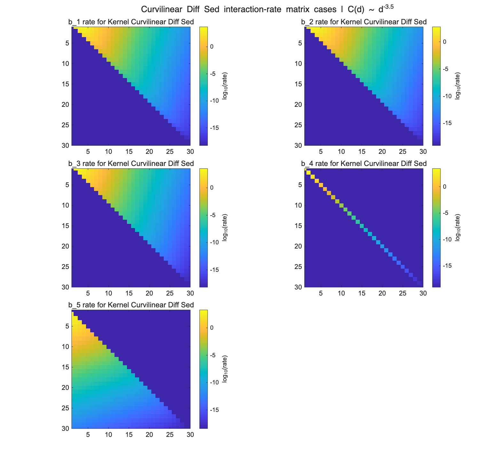

This is better than beta alone because it includes concentration too.

I also checked White settling more carefully.

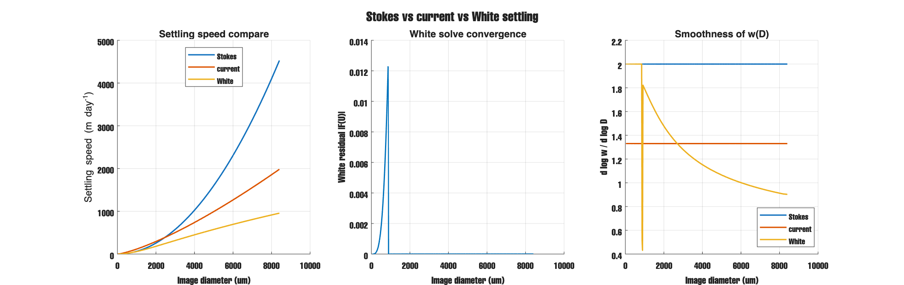

The simple point is:

- White depends on Reynolds number
- Reynolds depends on velocity
- so it needs an iterative solve

That part now looks cleaner.

So my current view is:

**the size spectrum likely contains more information than slope alone, but the part that survives observation is not exactly the same as the clean model signal.**
