# Report - Mar 30, 2026

After the last meeting, i tried to follow the questions more directly. Before, i was mostly making figures and then asking what they might mean. This time, i tried to work more like a record: what i checked, why i checked it, what i found, and what still looks uncertain.

the main questions from the meeting were simple. Are some PSD changes smaller than the fitting uncertainty? Why do the volume-diameter cases sit almost on a line? Why do the sinking laws separate so much? Which metric is safer after the observation step? And if there is one strong shared pattern, can it be reduced to one simpler summary?

So this follow-up work became less about making more plots and more about separating four things: real process signal, fitting-method effects, size-definition effects, and observation effects.

WhAT now looks strongest to me is one linked story. Much of the volume-space pattern is geometric, but not all of it. After removing that geometric part, a real sinking-law signal is still left. Then, once the observation step is included, image space looks safer than corrected volume space. In that safer image space, the non-`current` laws mostly move along one common `b`-`RMSE` axis, while `current` behaves more like a different regime.

## the main metrics i used

I kept the PSD fit simdple. I worked in log-log space,

\[
x = \log_{10}(D), \qquad y = \log_{10}(N)
\]

and first fitted a staraight line. The slope of that line gives `b`, so `b` just means how steep the PSD is.

Then i looked at what was left after removing that straight line. If the PSD still bends up or down, i call that `kappa` **(the PSD bend)**. So `kappa` is not another slope. It is a simple way to measure whether the PSD shape is curving after the main slope is removed.

I also used `RMSE`, which tells me how large the leftover mismatch is, and `run length`, which tells me how long the residual stays on one side before changing sign.

For the image-to-volume part, i used

\[
D_v = C D_i^{\eta}
\]

with `eta = 0.776667`. Later, in the image-space part, i also used one simple scalar along the main shared direction,

\[
s_{\parallel} = [\Delta b, \Delta \mathrm{RMSE}] \cdot u
\]

which just means: take the shift in `b`, take the shift in `RMSE`, and ask how far the point moves along the main axis.

## first, i checked whether the process signal is bigger than fit-method spread

This was one of the most direct questions from the meeting, so i started here. I did this in `run_fit_method_vs_process_benchmark.m`. The idea was simple: if a small process shift is not bigger than the fit-method spread, i should not read too much physics into it. I built one benchmark with three fit methods: ordinary least squares in log-log space, Theil-Sen, and nonlinear least squares. Then i compared how much the metrics changed because the process changed, and how much they changed only because the fit method changed.

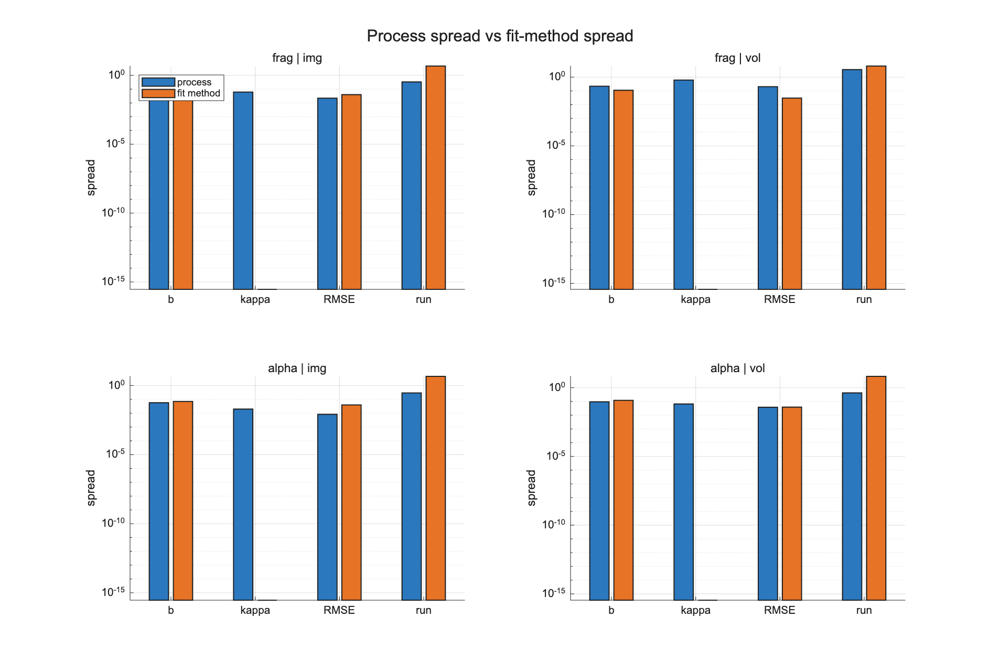

The main thing this figure says is that fragmentation in `b` is usually larger than the fit-method spread, but the alpha-only shift is often not much larger. For example, in image space the fragmentation-to-method ratio for `b` was about `2.23`, while for alpha it was only about `0.64`. So some changes are clearly strong, but some smaller ones are not.

For `kappa` **(the PSD bend)**, the fit-method bar is almost not visible here. That is not a missing result. It is because the fit-method spread for `kappa` was almost zero in this test, so on the log plot it falls to the bottom. In other words, the fit method barely changed `kappa` here.

So my first clear result was that not every small shift should be read in the same way. Some are safely bigger than fitting uncertainty, and some are not.
I still read this as a benchmark result, not a universal rule, because it depends on the PSD cases and fit methods used here.

## then, i checked why the volume-diameter cases lie close to a straight line

This was the other direct question from the meeting. I first checked how line-like the delta-space looked in `run_volume_delta_linearity_check.m`.

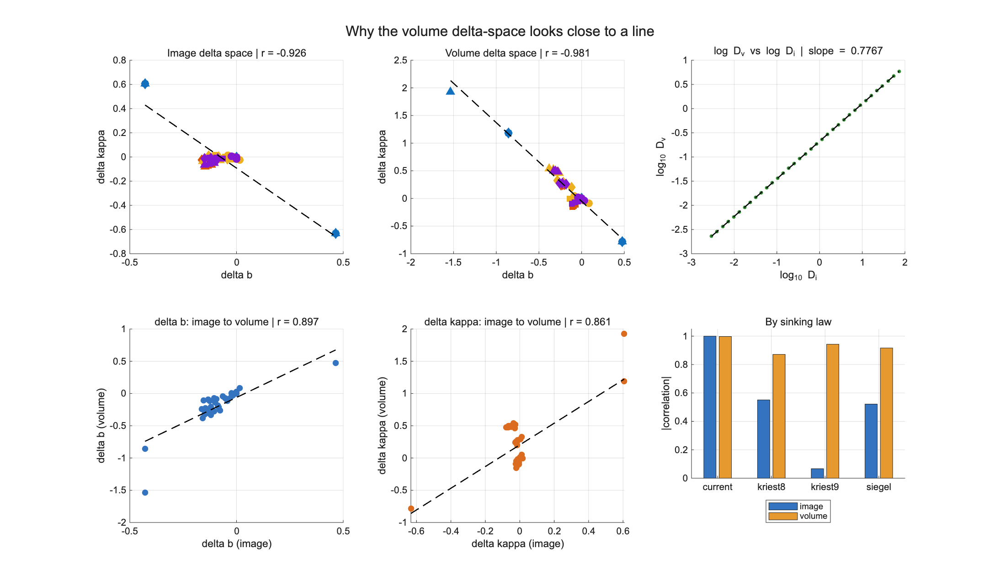

The line was very strong in volume space. The correlation there was about `-0.981`, stronger than the image-space correlation. That made me think the line was probably real, but it still did not tell me whether it came from process physics or from the diameter map itself.

So i checked that next in `run_volume_metric_transform_benchmark.m`.

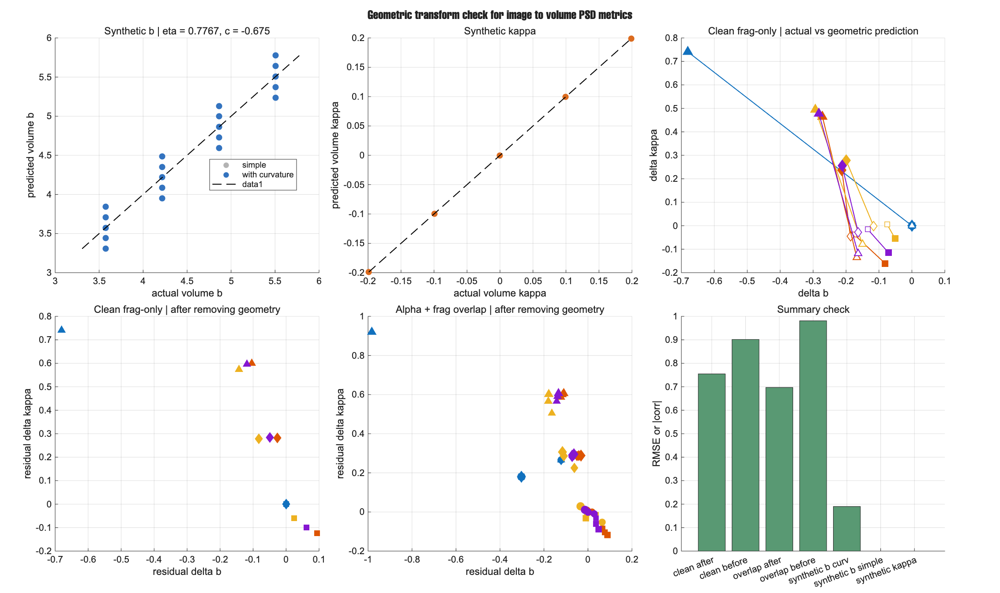

Using the simple image-to-volume map, i derived a simple prediction for how `b` and `kappa` **(the PSD bend)** should move when the diameter axis is changed. That test showed that a large part of the volume-space line comes from the size transform itself. But the points did not collapse fully after removing that geometric part. The correlation weakened, but it did not disappear.

So my reading here is that the volume-space line is only partly a process story. A big part is geometric, coming from the image-to-volume conversion, but a real process part is still left after that. This was important because it stopped me from over-reading the volume-space line as if it were all process physics.

## then, i checked what was still left after that geometry part was removed

Once the geometric part was removed, i asked the next question: if that size-definition effect is taken out, do the sinking laws still stay different? I did this in `run_sinking_law_residual_mechanism_benchmark.m`. The idea came naturally from the previous section: if the line is partly geometry, i still need to know what real physics is left after that part is removed.

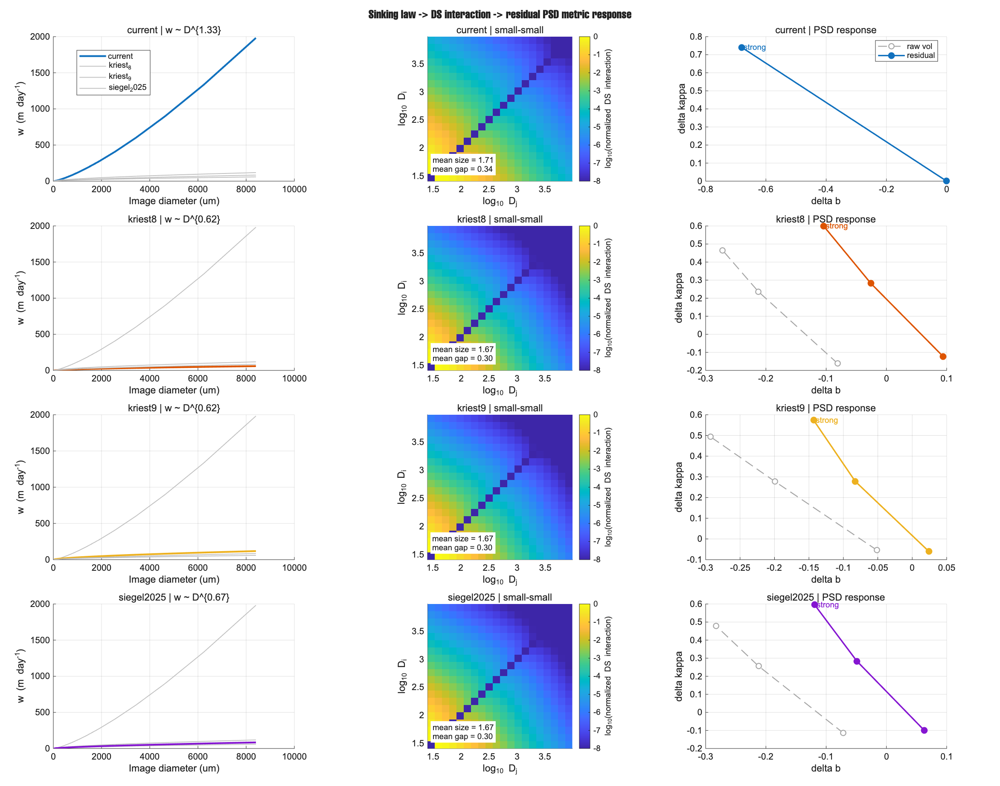

The answer was yes. The `current` law still stayed far away from the other three. Its settling-speed slope with size was much steeper, and the residual PSD shift after the geometry correction was still much larger. The other three laws stayed much more grouped.

So this helped me say something stronger. The sink-law difference is not only a size-definition effect. A real process difference is still left after the geometry part is removed.

## then, i checked which metrics and which observation space are safer

After that, the practical question became more important: once the PSD goes through a UVP-like observation step, which metric is safer to keep? I ranked the metrics in `run_image_metric_rank_benchmark.m`, then compared image space and corrected volume space in `run_image_vs_volume_space_compare.m`. This part came from the meeting question about what observations can really tell us.

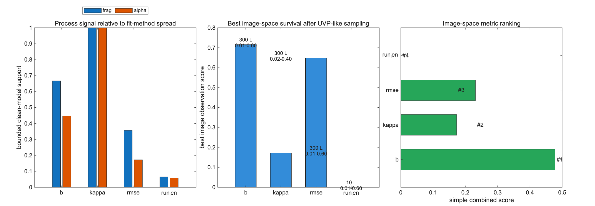

This benchmark changed my thinking a little. Before, `kappa` **(the PSD bend)** looked like the most interesting metric. But after adding both fit-method spread and UVP-like sampling, `b` came out as the safest image-space metric, and `RMSE` came second. `kappa` still looked useful, but more as a support metric than the main one.

Then i checked image space and corrected volume space directly.

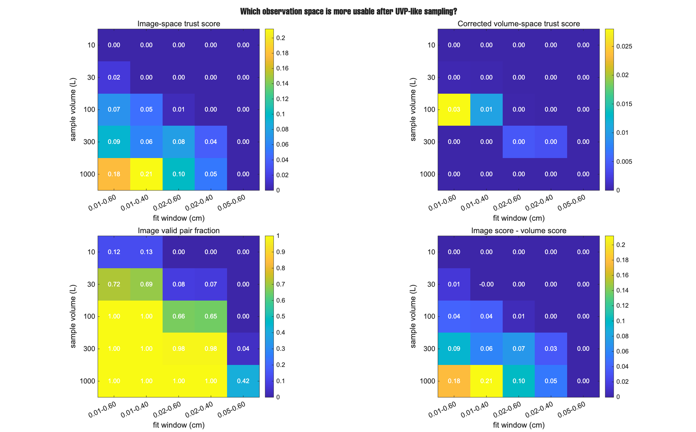

That gave the cleaner practical answer. Image space was clearly safer than corrected volume space in this setup. The corrected volume-space fits were still too unstable after sampling. So right now, for the observation-facing comparison, image space looks like the safer place to work.
This is not the flashiest result in the report, but it may be one of the most useful because it tells me which space is safer to trust.

## then, i checked fragmentation against stickiness and turbulence in that safer image space

Once image space looked safer, i kept the comparison there and used `delta b` plus `delta RMSE`. I tested fragmentation against stickiness in `run_image_space_b_rmse_separability.m`, and fragmentation against turbulence in `run_image_space_b_rmse_turbulence.m`. The idea was simple here too: if image space is the safer observed space, then the next separation tests should be done there, not in the less stable corrected volume space.

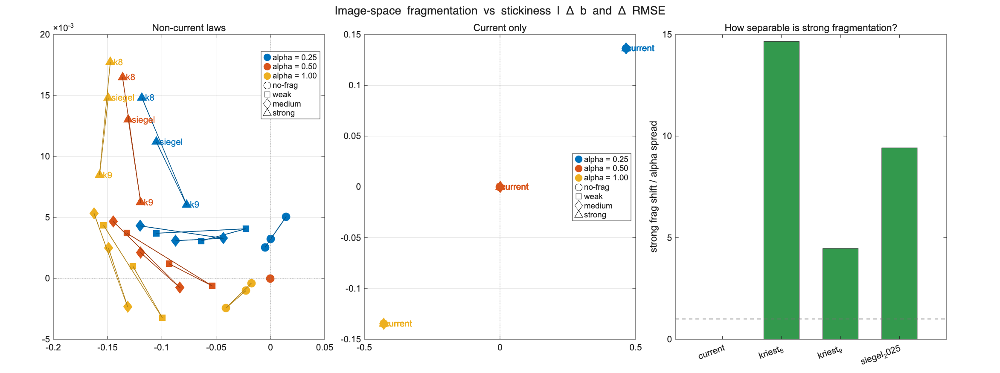

In this figure, strong fragmentation was much larger than the alpha spread for the three non-`current` laws. The ratios were not small. They were several times larger, and in `kriest_8` they were more than ten times larger. But `current` again did not follow the same clean pattern.

i then did the same check for turbulence.

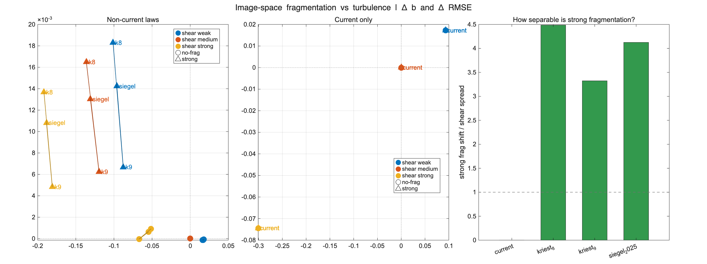

The result stayed similar. For the three non-`current` laws, strong fragmentation was still a few times larger than the turbulence spread. So in this safer image-space view, fragmentation was still standing out more clearly than i first expected. Again, `current` stayed the odd case.

## then, a new pattern appeared: one common axis in image space

After those image-space figures, a stronger pattern appeared. The non-`current` laws were not only grouped. They were moving mostly along one shared direction. I tested that directly in `run_image_space_common_axis_test.m`. The idea came from just looking at the image-space points and asking whether they were only clustered, or whether they were really lying on one main line.

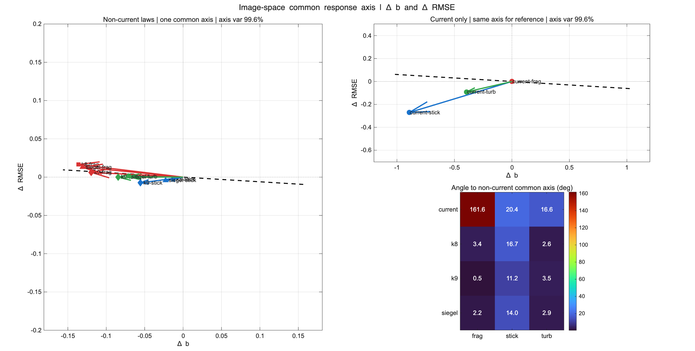

This was one of the strongest new results from the follow-up work. The first axis explained about `99.6%` of the variance. So for the non-`current` laws, fragmentation, stickiness, and turbulence were mostly moving along the same line in `delta b` and `delta RMSE`.

That changed the question a little. It stopped being only “do these processes overlap?” and became more “do they mostly differ by how far they move, more than by where they point?”

At this stage, i think this common-axis result is stronger than the later scalar-correction part. The axis itself looks real. The correction method built on top of it is still less mature.

## then, i tested whether one scalar on that axis could summarize the process shift

Once that common axis appeared, i tried to reduce the image-space shift to one scalar along that axis. I used `run_image_space_axis_scalar_calibration.m` and `run_image_space_raw_vs_scalar_compare.m` for this. The idea came directly from the common-axis figure: if most of the signal sits on one line, maybe one scalar along that line can summarize the process shift.

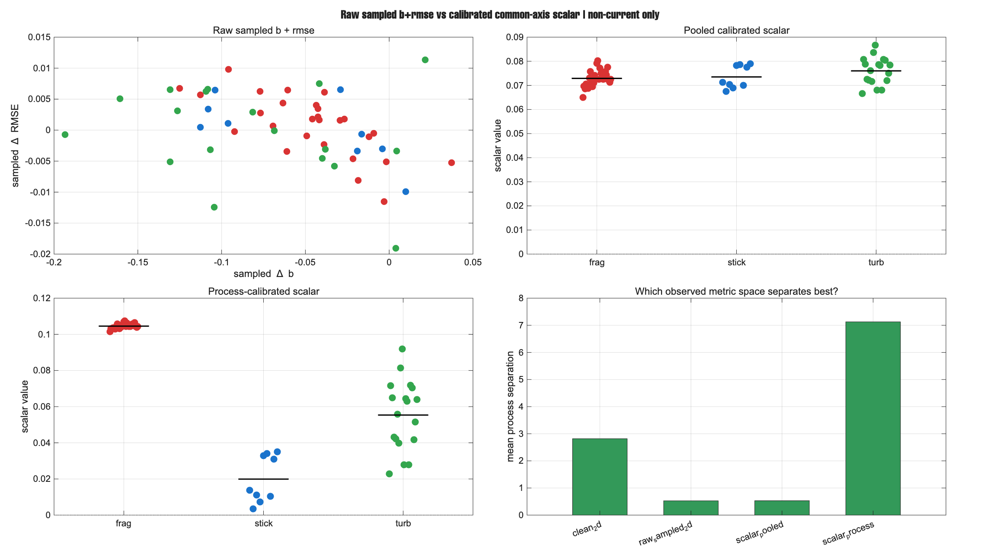

The first compare showed that the pooled scalar correction was almost the same as the raw sampled `b + RMSE` view. It did not give a big gain by itself. But if i used the true process grouping in the correction, the separation became much stronger. That made the scalar idea look promising, but it also showed an immediate caution: the strong version was not blind yet. It already knew the process family.

The idea for this came from two places. First, the common-axis figure itself suggested that most of the non-`current` response was living on one line, so it felt natural to ask whether one scalar along that line could summarize the shift. Second, i found nearby papers showing that low-dimensional size-distribution summaries are reasonable, and that process inference from size distributions should be checked with synthetic and noisy tests before being trusted ([Chan and Mozurkewich, 2007](https://acp.copernicus.org/articles/7/887/2007/acp-7-887-2007.html); [McGuffin et al., 2021](https://gmd.copernicus.org/articles/14/1821/2021/index.html)).

## then, i tested whether a small branch rule could recover that stronger scalar

To make that scalar more practical, i tested whether a small observed-feature branch rule could pick the right correction. I did this in `run_image_space_axis_scalar_branch_richer.m`.

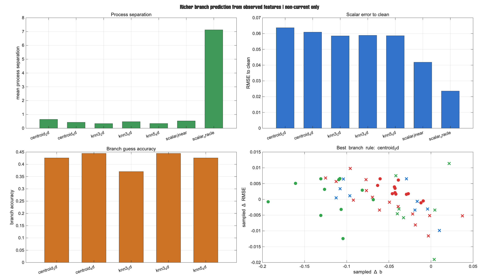

The idea for this came directly from the previous steps. First, the common-axis result suggested that the non-`current` cases were mostly moving on one line in image-space `delta b` and `delta RMSE`. Then the scalar test showed that a process-specific correction could work much better than one pooled correction, but only if the process family was already known. So the next question became simple: can the observed metric space itself guess that process family well enough before the correction is applied?

Here the branch names were simple test rules that i made from the sampled metric space. `centroid_2d` means a nearest-center rule using two observed features, mainly sampled `delta b` and sampled `delta RMSE`. `centroid_4d` uses four observed features. The `knn` cases are nearest-neighbor rules, where the number tells how many nearby cases vote, and `2d` or `4d` tells how many observed features are used. So these were not special marine PSD methods taken from one marine-snow paper. They were simple test classifiers that i built to see whether the observed feature space could choose the correction branch in a reasonable way.

This part was useful because it showed what does **not** work well yet. Even the richer branch tests only gave branch accuracy around `0.37` to `0.44`, and they did not beat the simple pooled linear correction in a convincing way. So the short version is that the richer branch idea is still weak in this observed space.

So one pooled correction is too simple, but a small observed-feature branch rule is also too simple. The common-axis scalar still looks more useful as a research clue and a model-space summary than as a finished blind observation metric.

## what i think

The strongest chain in this report is this. The volume-space line is real, but much of it is geometric. After removing that geometry part, a real sinking-law signal is still left, and `current` still stays physically different. Then, after the observation step is included, image space looks safer than corrected volume space. In that safer image space, `b` and `RMSE` look like the more reliable practical metrics.

The new idea that came out most strongly is this: for the non-`current` laws, fragmentation, stickiness, and turbulence mostly move along one common axis in image-space `delta b` and `delta RMSE`. That feels like a real scientific result. The scalar-recovery part below it is still weaker and should be read more cautiously.

## main result now

The clean model still contains useful PSD-shape information beyond slope alone, but a large part of what we see can be changed by fitting, size definition, and observation. Much of the volume-space structure is geometric, but after removing that geometry part a real sinking-law process signal remains. In the safer observation-facing image space, `b` and `RMSE` look most useful right now. For the non-`current` laws, fragmentation, stickiness, and turbulence mostly move along one common axis, while the `current` law behaves more like a different regime. The scalar idea is promising, but it is still a support result, not the main result, because one pooled correction is too simple and the small branch rules are still too weak to make it a blind observation metric.
