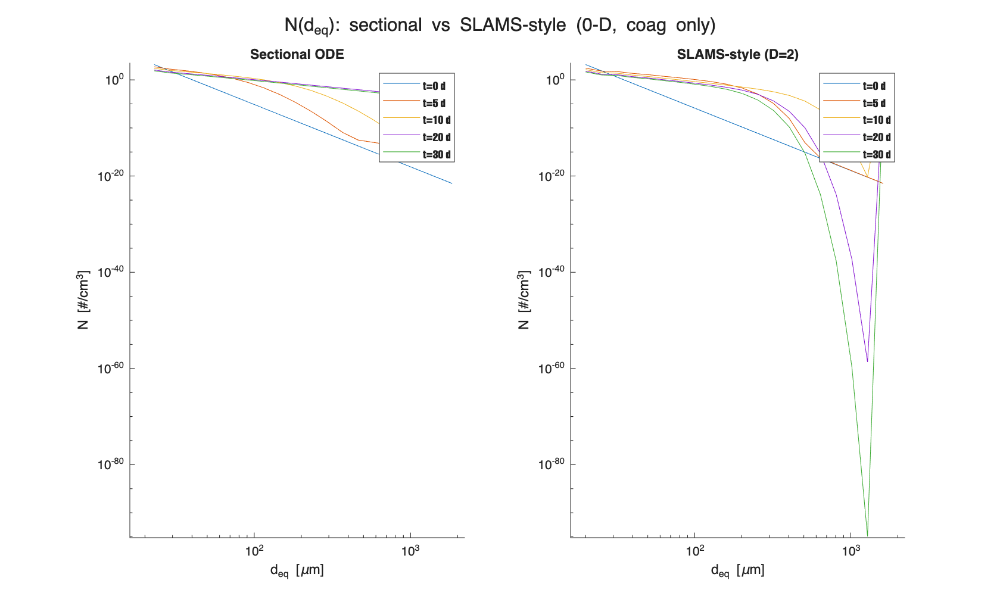
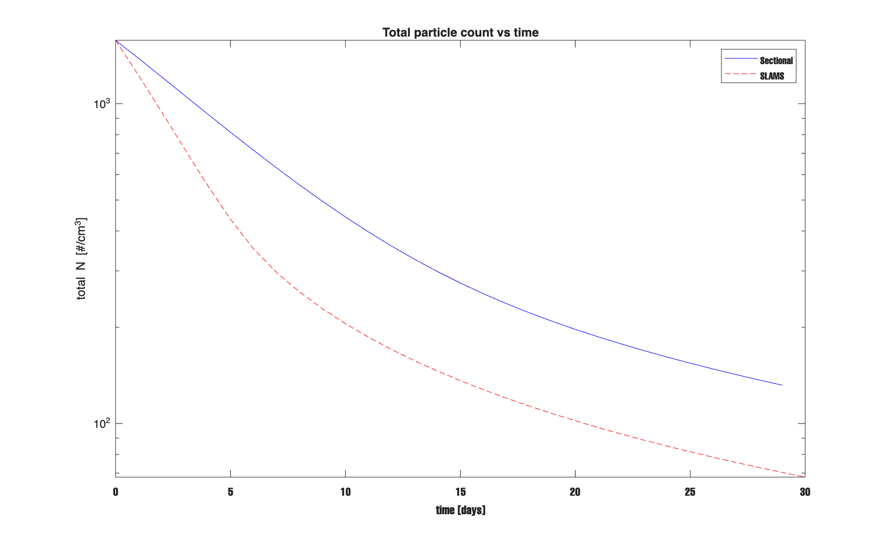
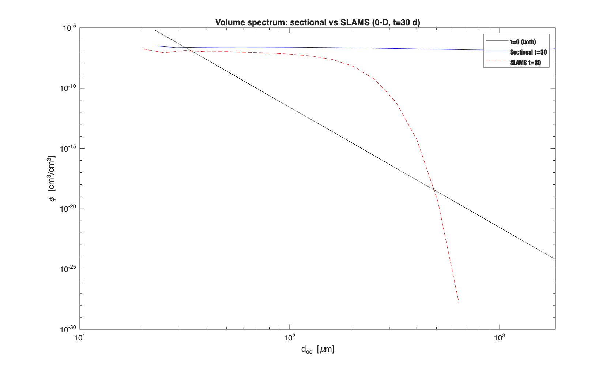

# Report — May 13, 2026
## 0-D Model: SLAMS Super-particle vs. Sectional ODE  Aggregation Comparison


## 1. What This Test Does

Both models run a 0-D slab with coagulation only — no sinking, no fragmentation, same initial conditions, same kernels, same parameters. The goal is to check whether the two algorithms produce the same physics when everything else is equal.


## 2. Algorithm Difference

**Sectional ODE.** State variable is biovolume concentration $\phi_k = N_k \cdot v_k$ [cm^3 cm^-3]. The Smoluchowski equation is solved continuously in time via `ode45`. The $\beta$ matrix (in `BetaAssembler`) integrates $(m_i + m_j)/(m_i m_j)$ times the kernel over both bin volumes, giving rates in [day^-1] that work directly with $\phi$.

**SLAMS-style super-particle.** State variable is number concentration $N_k$ [cm^-3]. Each bin $k$ holds one super-particle tracking $N_n(k) = 2^{k-1}$ primary particles per aggregate with fractal dimension $D = 2$ (hardcoded in the original SLAMS Fortran). Time stepping is explicit forward-Euler with 24 sub-steps per output day.

When bins $i$ and $j$ collide, the merged aggregate has $N_n^{\text{new}} = N_n(i) + N_n(j)$. This is snapped to the nearest existing bin $k$ on a log scale. Snapping does not conserve volume on its own, so the gain is scaled:

$$
\Delta N_k \leftarrow \Delta N_k + \Delta Q \cdot \frac{N_n(i) + N_n(j)}{N_n(k)}
$$

where $\Delta Q$ is the merger count for the sub-step. Without this factor, volume drifts whenever $N_n^{\text{new}}$ does not land exactly on a bin. After adding it, SLAMS volume drift is 0.00%.

```matlab
k          = target(i,j);
Nn_new     = Nn(i) + Nn(j);
mass_scale = Nn_new / Nn(k);
dn(k)      = dn(k) + dQ * mass_scale;
```

---

## 3. Shared Physics

i found Both models use the same three collision kernels. The kernel expressions are identical in `slams_beta.m` and `KernelLibrary.m`.

$$
\beta_{\mathrm{Br}} = \frac{2 k_B T}{3 \mu} \cdot \frac{(r_1 + r_2)^2}{r_1 r_2}
$$

$$
\beta_{\mathrm{sh}} = \sqrt{\frac{8\pi}{15}}\, \gamma\, \varepsilon\, r_g^3
$$

$$
\beta_{\mathrm{DS}} = \frac{\pi}{2}\, r_{\mathrm{small}}^2\, |w_1 - w_2|
$$

where $r_g = (r_1 + r_2) \cdot 1.6$, $\varepsilon$ is the curvilinear efficiency, and $r_{\mathrm{small}} = \min(r_1, r_2) \cdot 1.6$. Settling speed from Kriest_8:

$$
w = B\, d_{\mathrm{eq}}^{0.62}, \quad B = 66\;[\mathrm{m\ day^{-1}\ cm^{-0.62}}], \quad d_{\mathrm{eq}}\ \mathrm{in\ cm}
$$

Parameters: $T = 293$ K, $\gamma = 0.1$ s^-1, $\alpha = 1.0$, and `r_to_rg = 1.6`.

One structural difference: the sectional model uses $D_f = 2.33$ for aggregate radii; SLAMS uses $D = 2.0$. This affects $r_{\text{agg}}$ and all three kernels, so a perfect quantitative match is not expected.

---

## 4. Figure 1 — N(d_eq) Spectra Over Time

Both panels use volume-equivalent diameter $d_{\text{eq}}$ [um] as the x-axis and share the same axis limits.

- Sectional: $d_{\text{eq}} = 2 \cdot r_{\text{conserved}}(k)$ from `grid.getConservedRadii()`
- SLAMS: $d_{\text{eq}} = 2 \cdot a_0 \cdot N_n(k)^{1/3}$



*Figure 1. Number concentration $N$ [cm^-3] vs volume-equivalent diameter $d_{\text{eq}}$ [um] at $t = 0, 5, 10, 20, 30$ days. Left: sectional ODE. Right: SLAMS-style. Same axis limits in both panels.*

- At $t = 0$ both models start from the same power-law spectrum. Over 30 days aggregation depletes the small-particle end and builds up the large-particle end. The spectrum shifts right and flattens.

**i think wwhy SLAMS shifts faster.** two effects add together. First, at $D = 2$, aggregate radii are larger for the same $N_n$ than at $D_f = 2.33$, which increases collision rates. Second, nearest-bin snapping has an upward size bias for some merges. A direct check with the new tests confirms both are active: changing only $D$ changes final total $N$ by more than 1%, and changing only snap mode (`nearest` vs `split`) changes final total $N$ by more than 0.5%.

---

## 5. Figure 2 — Total N vs. Time

Total $N = \sum_k N_k$ [cm^-3] on a log scale, both models on the same axes.



*Figure 2. Total particle count vs time, log scale. Blue solid: sectional ODE. Red dashed: SLAMS-style.*

**What it shows.** Both curves fall monotonically. Coagulation converts many small aggregates into fewer large ones, so total count must drop. Both models agree qualitatively.

| Model | Total $N$ change over 30 days |
|---|---|
| Sectional ODE | −91.65% |
| SLAMS-style   | −95.70% |

SLAMS loses count faster in this default setup. The gap opens steadily as the two models build different size distributions. Dedicated tests show that both fractal-dimension choice and snap rule contribute to the difference.

---

## 6. Figure 3 — Volume Spectrum at t = 30 days

Instead of $N(d)$, this plot shows $\phi_k = N_k \cdot v_k$ [cm^3 cm^-3] — the actual volume of particles in each size bin. This is the physically relevant quantity for mass budgets and carbon flux. The initial spectrum at $t = 0$ is the same for both models and is shown in black for reference.



*Figure 3. Volume spectrum $\phi(d_{\text{eq}})$ at $t = 0$ (black) and $t = 30$ days for sectional ODE (blue solid) and SLAMS-style (red dashed). Log-log axes.*

At $t = 0$ both models sit on the same curve. By $t = 30$ days the two spectra have diverged — SLAMS has moved more volume to the large-particle end, while the sectional model retains more volume at intermediate sizes.

**Why this matters.** Small particles dominate the count but carry little volume. Large particles are rare by count but can hold most of the volume. Figure 1 shows the count shift; Figure 3 shows where the mass actually goes. The fact that SLAMS carries more mass in large bins by day 30 means that if sinking were turned on, SLAMS would export more carbon to depth over the same 30-day run. This follows from both effects identified in Section 4: fractal-dimension choice and snap mapping.

---

## 7. Volume Conservation Check

Total primary-particle volume:

$$
V_{\mathrm{total}} = \sum_k N_k \cdot N_n(k) \cdot v_0 \quad (\mathrm{SLAMS})
$$

$$
V_{\mathrm{total}} = \sum_k \phi_k \quad (\mathrm{sectional})
$$

| Model | Volume change over 30 days |
|---|---|
| Sectional | −39.93% |
| SLAMS     | 0.00% |

The sectional loss is not a coding error. The initial spectrum is not near the upper boundary (top-bin initial fraction is $9 \times 10^{-20}$), so this is not an initialization artefact. During the run, material moves into the largest resolved bins and truncation starts to matter (for `n_sections=20`, top-bin final fraction is about 4.4%). When two particles in the largest bin merge, the product has no bin above it and the extra mass is dropped. Running with `n_sections = 40` reduces the loss to −27.66%, confirming the cause. More bins push the truncation point to larger sizes but do not eliminate the loss with a finite grid.

SLAMS has no overflow issue. Bin 20 is the ceiling and same-bin merges saturate there. The mass-scale correction above ensures no volume is lost through bin-snapping within range.

Forward-Euler stability in SLAMS was also checked. With `n_sub=24` vs `n_sub=48`, the final total number differs by only 0.27%, which is well within the ~1% tolerance used in the D/snap separation tests, so 24 sub-steps is stable for this setup.

---

## 8. Summary

- SLAMS aggregates faster in this default setup (`D=2`, nearest snap).
- The volume spectrum (Figure 3) shows that SLAMS carries more mass in large bins by day 30. 
- SLAMS volume conservation is exact (0.00%) after adding the mass-scale bin-snap correction.
- Sectional volume loss (−39.93%) is a top-bin truncation artefact, not a physics error i think.
- The two algorithms are consistent in their qualitative behavior. Quantitative differences trace back to $D = 2$ vs $D_f = 2.33$, not to a mismatch in the collision physics.
