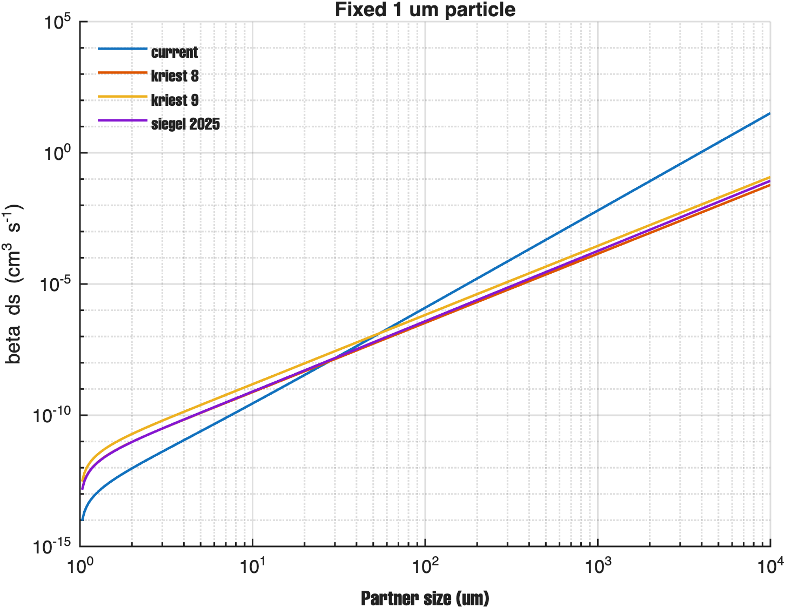
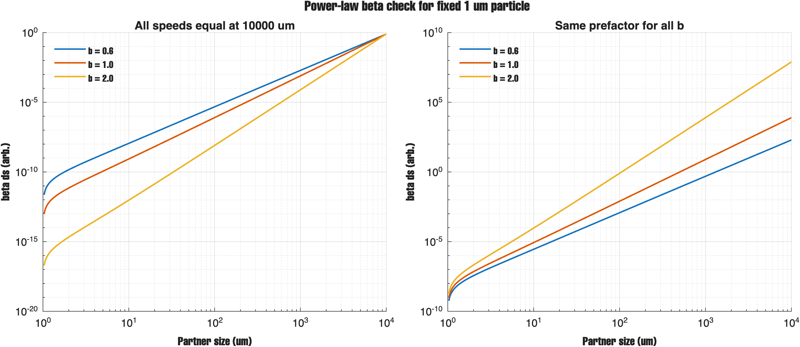
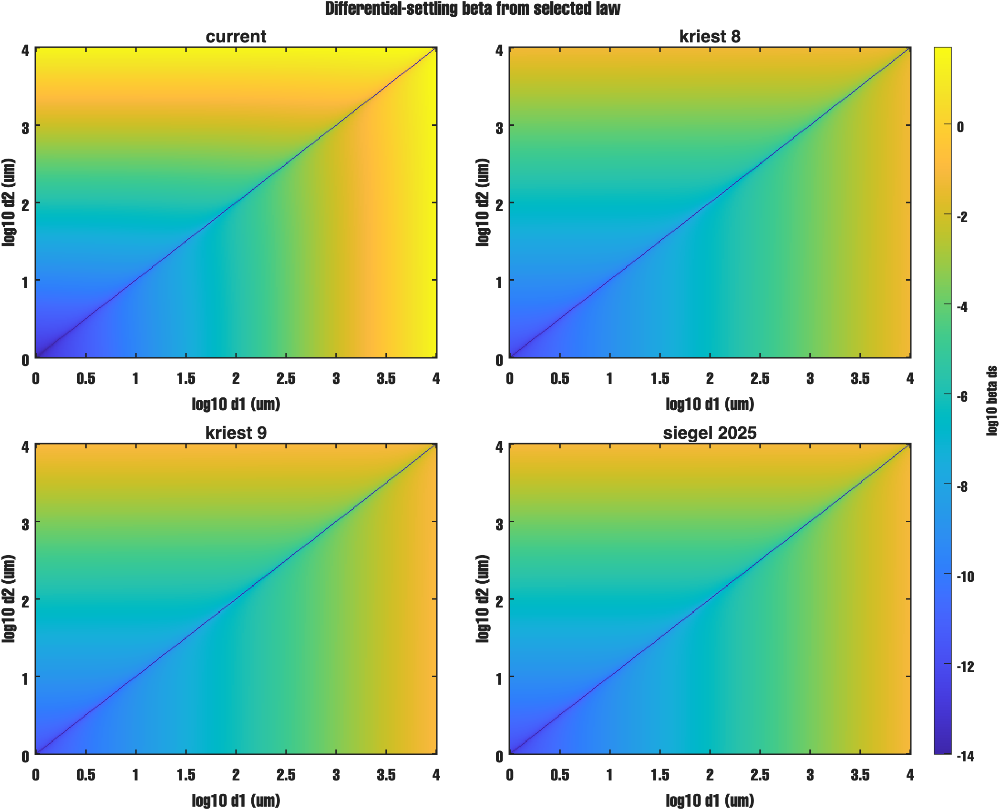
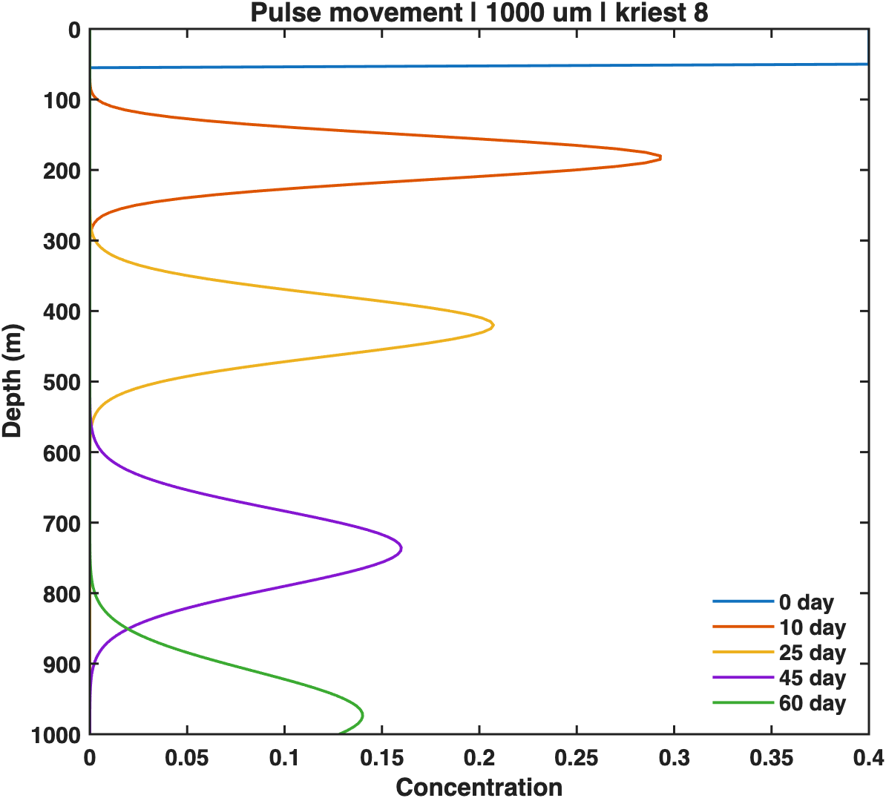
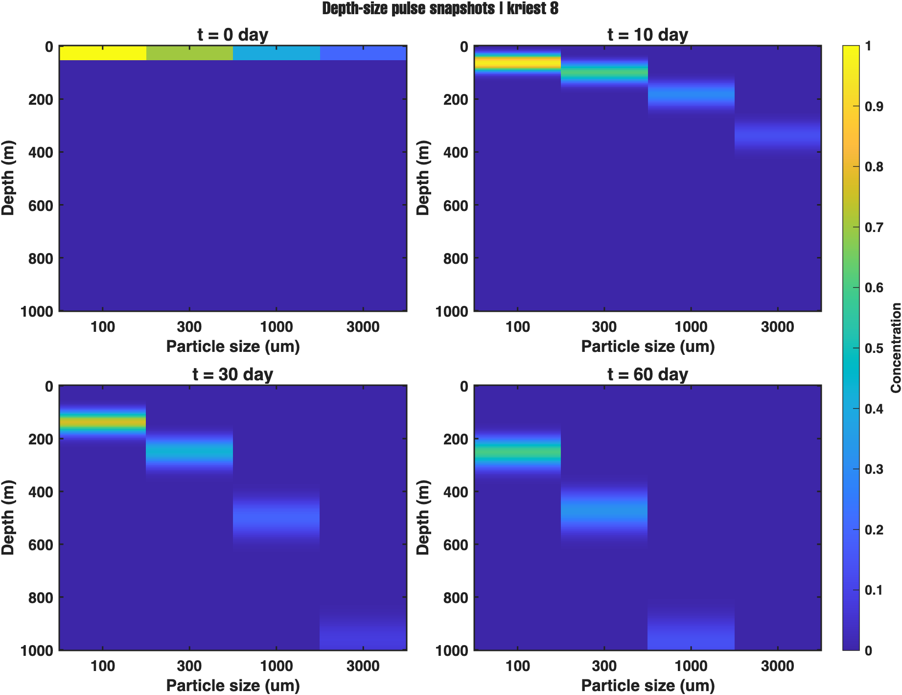

# Report - May 06, 2026

The same model equations are used in all checks. Sinking speed is `w = a d^b`, 
- differential-settling kernel is `beta_DS = (pi/4) * (d1 + d2)^2 * abs(w1 - w2)`
- weighted interaction is `I_DS = beta_DS * C1 * C2`. 
- For the DS versus shear maps in this report, the plotted field is `log10(beta_DS / beta_shear)`. 
- If both kernels are multiplied by the same `C1*C2`, that factor cancels, so the map pattern stays the same. The diffusion identity shown here, `d/dz(Kz*dN/dz) = Kz*d2N/dz2 + (dKz/dz)*(dN/dz)`, is only the diffusion part and not the full 1-D transport equation.

This first figure is the sinking-speed slope sweep. The confusion was that the high-`b` lines looked lower at small size. The reason is normalization: all curves are forced to meet at `d = 10000 um`. With this setup, left-side ordering can look reversed even when the formula is correct. So this figure is mathematically correct, but the normalization rule must be said clearly in the caption.

This figure fixes one particle at `d1 = 1 um` and scans partner size. It was made to check if different sinking laws really separate in DS. The separation is clear at large size. At `d2 = 10000 um`, `beta_DS` is `3.253824e+01` for `current`, `1.196180e-01` for `kriest_9`, `8.572471e-02` for `siegel_2025`, and `5.980899e-02` for `kriest_8` in `cm^3 s^-1`. This confirms the law effect is real and large in the big-size range.

This figure is the direct check of the ordering confusion. In the left panel, forced end-point matching can flip visual order at small sizes. In the right panel, one shared prefactor is used without forced meeting, and the expected order returns. The numeric check with `d1 = 1 um` and `d2 = 10, 100, 1000, 10000 um` also stays consistent with `b=2.0 > b=1.0 > b=0.5` for off-diagonal large-size pairs. So the earlier backward-looking trend came from display scaling, not from a wrong sign in the DS kernel.

This full DS pair map shows the expected structure: weak diagonal where sizes are equal, and stronger off-diagonal regions where settling-speed difference is larger. DS stays non-negative because of the absolute value in the kernel. There is one display issue that must be noted in this saved image. The colorbar top is near `0`, but from the fixed-particle check we have `beta_DS(current, 1 um, 10000 um) = 3.253824e+01`, so `log10(beta_DS) ~ 1.51`. That means the top range in the `current` panel is clipped. This map should be redrawn with upper color limit at least `+2`, or with separate panel colorbars and a clear note.

This weighted DS map checks interaction strength after concentration weighting. The main story is that weighting shifts strong areas toward regions where both interaction strength and abundance are high. Because of this, law differences can look smaller than in the beta-only map. This behavior is expected and consistent with the equation.

These DS versus shear ratio maps were checked for both direction and color meaning. The plotted value is `log10(beta_DS / beta_shear)`. Blue is negative (`shear > DS`) and red is positive (`DS > shear`). The trend with turbulence is correct: DS-dominant area becomes smaller as `epsilon` increases. For `kriest_8`, the DS-dominant fraction goes from `0.968` to `0.845` to `0.627`. The shape difference across laws is also meaningful. The `current` panel has a narrow V-shape near the diagonal, while the literature-law panels show a wider band. This comes from slope differences in sinking speed and stronger off-diagonal contrast for the steeper law.

These two pulse figures were read together as one transport story. The profile plot shows downward movement with time, and the depth-size snapshots show faster deep movement for larger sizes. The speed table gives `15.8323 m/day` for `1000 um`, so in `60 days` the travel is about `950 m`, which is consistent with the profile behavior. In the 2-D snapshot, depth can look shallower by eye because one shared color scale is used for all sizes and times, and deeper late-time signal is weaker in color intensity than shallow small-size signal.

The code path check is now clear. DS default mode is `sinking_law` in both 1-D and main coag code, and `legacy` mode prints warning that selected law will not change DS values. This removes the old ambiguity that caused similar-looking law panels before.

